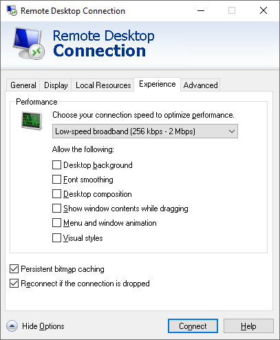

# Adjusting Remote Desktop Connection Settings

By default, when Veeam Backup & Replication launches the Remote Desktop Connection client, the client uses settings defined for the user account under which you are currently logged on to Microsoft Windows. In case high latency and low bandwidth impacts responsiveness of the Remote Desktop Connection client, you can adjust connection settings in one of the following ways:

* You can change the Remote Desktop Connection client settings and save them to a configuration file of the user account that is currently logged on to Microsoft Windows. By default, connection settings for each user are stored in a hidden file with the name Default.rdp that resides in the user's Documents folder, for example, C:\Users\Administrator\Documents.
* You can define custom Remote Desktop Connection client settings and save them to a configuration file with the name VmbpRdpConnection.rdp in the following product folder: C:\Program Files\Veeam\Backup and Replication\Console. In this case, Veeam Backup & Replication will use the necessary settings for the Remote Desktop Connection client regardless of the user account under which the OS is currently running.

To define custom remote desktop connection settings for Veeam Backup & Replication:

1. Open the Remote Desktop Connection client (mstsc.exe).
2. In the Remote Desktop Connection window, click Show Options.
3. Specify connection settings in accordance with quality of the network connection between the machine on which you open a remote desktop session and the tenant backup server. For slow connections, it is recommended that you define the following remote desktop settings:

1. At the Display tab, in the Colors section, select the High Color (16 bit) option. Using this option may significantly improve performance of the remote desktop client over low bandwidth or high latency connections.
2. At the Display tab, in the Display configuration section, reduce the size of the remote desktop.
3. At the Experience tab, clear all check boxes in the Allow the following section.
4. At the Local Resources tab, in the Remote audio section, click Settings and disable remote audio playback and recording.

1. At the General tab, click Save as and save the specified settings to the configuration file:

1. In the Save As window, browse to the C:\Program Files\Veeam\Backup and Replication\Console folder.
2. In the File name field, enter the name for the configuration file: VmbpRdpConnection.rdp.
3. Click Save.

|  |
| --- |
| Tip |
| You can define a custom name for the remote desktop connection configuration file used by Veeam Backup & Replication. To specify a name for the file, create the registry key HKEY\_LOCAL\_MACHINE\SOFTWARE\Veeam\Veeam Backup and Replication\VMBPShellRdpTemplateFilename (REG\_SZ) and enter the name for the file as the key value (for example, VeeamRdpConnection).  Note that you can change only the name for the configuration file, but not the full path to this file. The file must reside in the C:\Program Files\Veeam\Backup and Replication\Console folder. |

