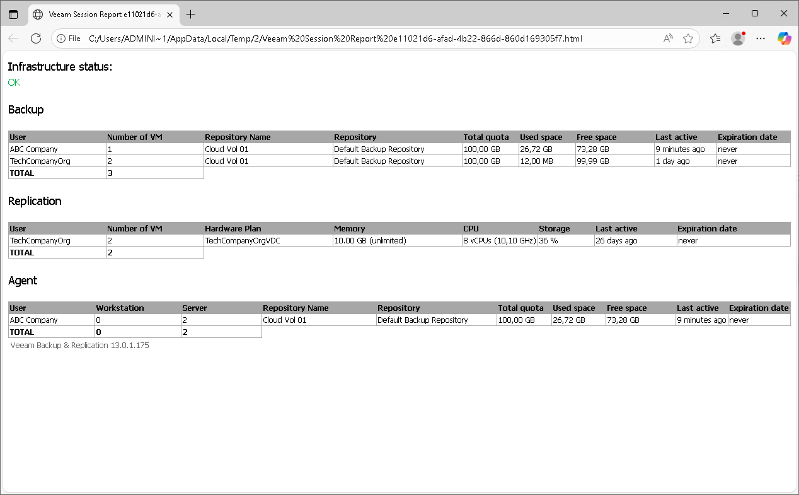
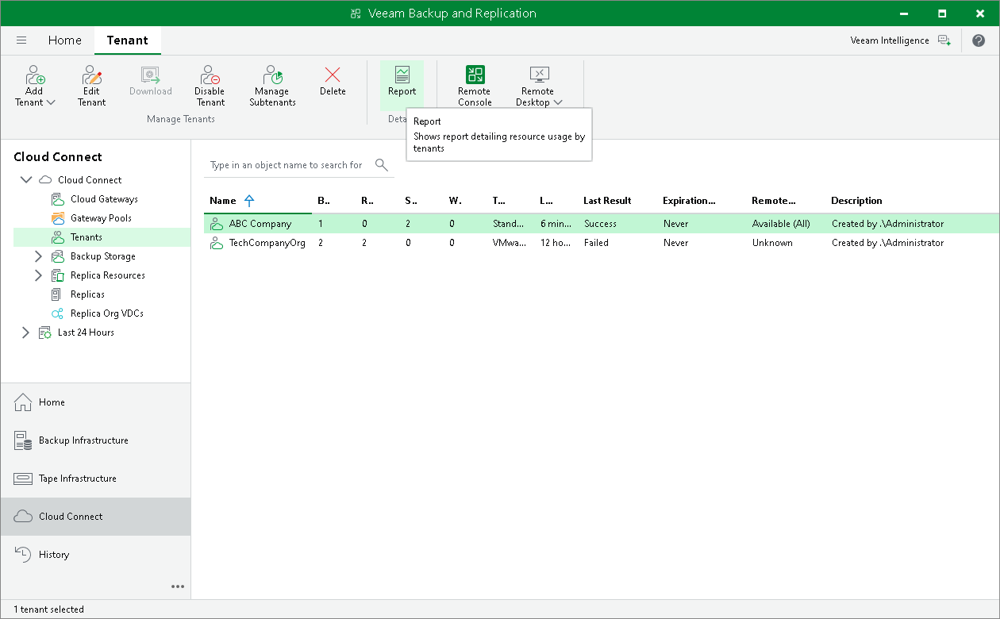

# Viewing Veeam Cloud Connect Report

To track status of the Veeam Cloud Connect infrastructure, the SP can use the Veeam Cloud Connect report. The report provides information about status of the Veeam Cloud Connect infrastructure and activity of tenants who consume cloud resources of the SP. The report helps the SP ensure that there are enough resources in the Veeam Cloud Connect infrastructure to guarantee the flawless performance of tenant jobs.

Information in the Veeam Cloud Connect report reflects the status of the Veeam Cloud Connect infrastructure at the point in time when the report is generated. The SP can generate the report in one of the following ways:

* The SP can use the Veeam Backup & Replication console to generate the ad-hoc report at any time the SP needs. The report will open in the web browser. The generated report can contain information about activity of all tenants who use cloud resources of the SP or a specific tenant. To learn more, see [Generating Report](#view).
* The SP can enable automatic report delivery by email. In this case, Veeam Backup & Replication will automatically generate and send the report daily to the SP. The report will contain information about activity of all tenants who use cloud resources of the SP. To learn more, see [Enabling Email Reporting](#email).

The report provides the following information:

* The Infrastructure status section shows a message describing the overall status of the Veeam Cloud Connect infrastructure:

* OK.
* Reaching capacity. Please do not add new tenants into this Veeam Cloud Connect infrastructure. — Veeam Backup & Replication displays this message if the Veeam Cloud Connect Service requires longer time to respond to requests from the tenant backup server, that is:

* [For ad-hoc report] If the time interval between an incoming request from the tenant backup server and a response to this request from the Veeam Cloud Connect Service reached the maximum of 5 to 10 minutes at least once within the 24-hour period. Veeam Backup & Replication starts the first 24-hour period with the start of the Veeam Cloud Connect Service on the SP backup server. The moment when the ad-hoc report is generated does not start the new 24-hour period.
* [For daily report] If the time interval between an incoming request from the tenant backup server and a response to this request from the Veeam Cloud Connect Service reached the maximum of 5 to 10 minutes at least once within the 24-hour period since the previous daily report.

* Out of capacity. Please migrate some of the existing tenants into a different Veeam Cloud Connect infrastructure. — Veeam Backup & Replication displays this message if the Veeam Cloud Connect Service requires very long time to respond to requests from the tenant backup server, that is:

* [For ad-hoc report] If the time interval between an incoming request from the tenant backup server and a response to this request from the Veeam Cloud Connect Service reached the maximum of 10 minutes or more at least once within the 24-hour period. Veeam Backup & Replication starts the first 24-hour period with the start of the Veeam Cloud Connect Service on the SP backup server. The moment when the ad-hoc report is generated does not start the new 24-hour period.
* [For daily report] If the time interval between an incoming request from the tenant backup server and a response to this request from the Veeam Cloud Connect Service reached the maximum of 10 minutes or more at least once within the 24-hour period since the previous daily report.

* The Backup section shows information about consumption of cloud repository resources by tenants: the user name of the tenant account, the number of VMs in backups stored on the cloud repository, the name of the cloud repository and the name of the backup repository whose resources the SP exposes as a cloud repository, storage quota assigned to the tenant, the amount of used and free space on the cloud repository, the last time when the tenant was active and the date when the tenant account expires.
* The Replication section shows information about consumption of cloud host resources by tenants: the user name of the tenant account, the number of VMs replicated to the cloud host, hardware plan, amount of provisioned CPU, memory and storage resources, the last time when the tenant was active and the date when the tenant account expires.
* The Agent section shows information about consumption of cloud repository resources by Veeam Agent backups created by tenants: the user name of the tenant account, the number of workstations and servers whose backups are stored on the cloud repository, the name of the cloud repository and the name of the backup repository whose resources the SP exposes as a cloud repository, storage quota assigned to the tenant, the amount of used and free space on the cloud repository, the last time when the tenant was active and the date when the tenant account expires.

In the Total field of the Backup, Replication and Agents sections, Veeam Backup & Replication displays the total number of processed machines:

* For a report that includes information about all tenants who use cloud resources of the SP, the total number of backed-up VMs, replicated VMs, backed-up workstations and servers reflects the number of machines processed by all tenants (including rental machines).
* For a report that includes information about a specific tenant, the total number of backed-up VMs, replicated VMs, backed-up workstations and servers equals the number of machines processed by this tenant (including rental machines).

|  |
| --- |
| Note |
| The Veeam Cloud Connect report does not include machines for which no restore points were created during the last 30 days or more. |

Generating Report

To view the Veeam Cloud Connect report that displays information about a specific tenant:

1. Open the Cloud Connect view.
2. In the inventory pane, click Tenants.
3. In the working area, select the tenant account and click Report on the ribbon.

|  |
| --- |
| Tip |
| The SP can generate a Veeam Cloud Connect report that displays information about multiple tenants. To view the report, use one of the following ways:   * To select multiple tenants, press and hold the [CTRL] key and click necessary tenants, then click Report on the ribbon. * To select all tenants, press [CTRL + A] to highlight all tenants, then click Report on the ribbon. |

Enabling Email Reporting

The SP can set up Veeam Backup & Replication to send the Veeam Cloud Connect report daily by email. To receive information about the Veeam Cloud Connect infrastructure status in email reports, the SP must enable and configure global email notification settings in Veeam Backup & Replication. To learn more, see the [Configuring Global Email Notification Settings](https://helpcenter.veeam.com/docs/backup/vsphere/general_email_notifications.html?ver=120) section in the Veeam Backup & Replication User Guide.

Once email notifications are configured, Veeam Backup & Replication will send the Veeam Cloud Connect report daily to an email address specified in the global email notification settings. The following rules apply to daily email reporting:

1. The first report is sent immediately after the SP enables the global email notification settings in Veeam Backup & Replication.
2. The second report is sent after 24 hours, plus the time required for the infrastructure check that elapsed since the first report was sent.
3. The third report and subsequent reports are sent using the same rules.

As a result, the time at which a report is sent is shifted forward with each subsequent report. Each day, the report is sent several seconds later than the day before. Keep in mind that the resulting time shift can become significant over time.

|  |
| --- |
| Tip |
| The SP can specify the time at which the daily report is sent. To do this, the SP must create the registry key HKEY\_LOCAL\_MACHINE\SOFTWARE\Veeam\Veeam Backup and Replication\CloudConnectReportTime (REG\_SZ) and enter the selected time as a registry value. Use the 24-hour clock and the time zone of the cloud service. For example, 21:30. |

