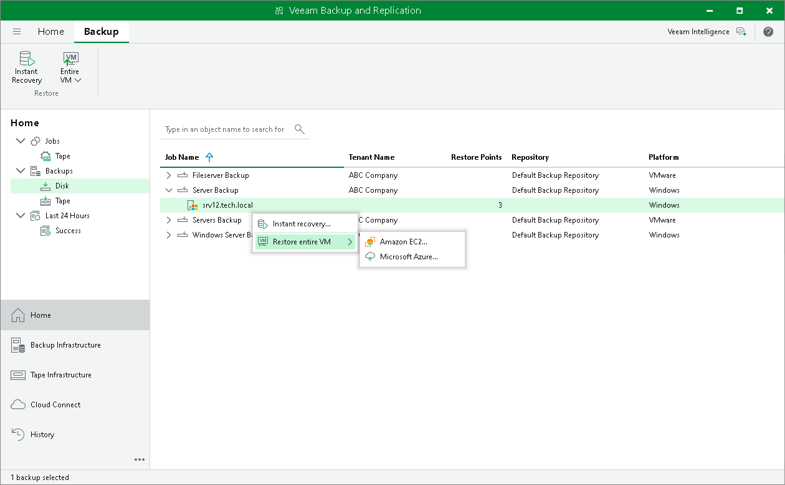
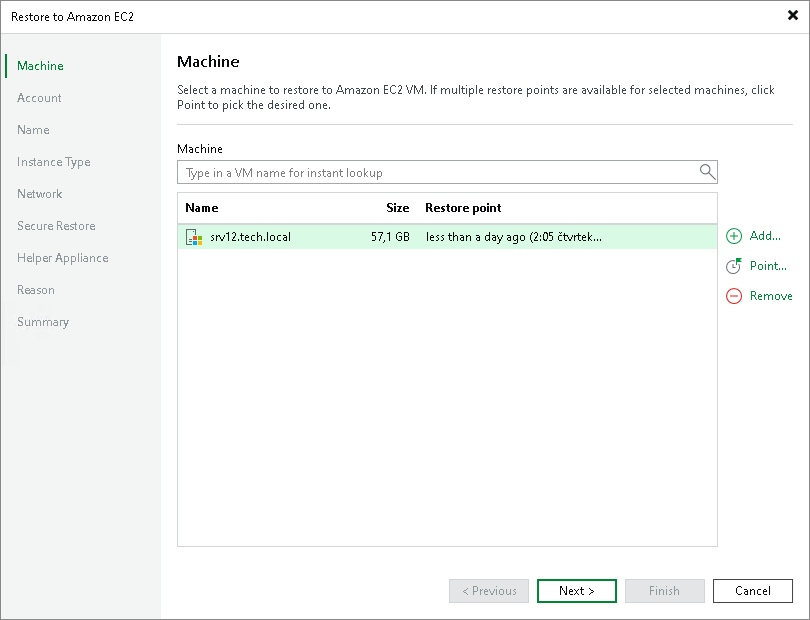
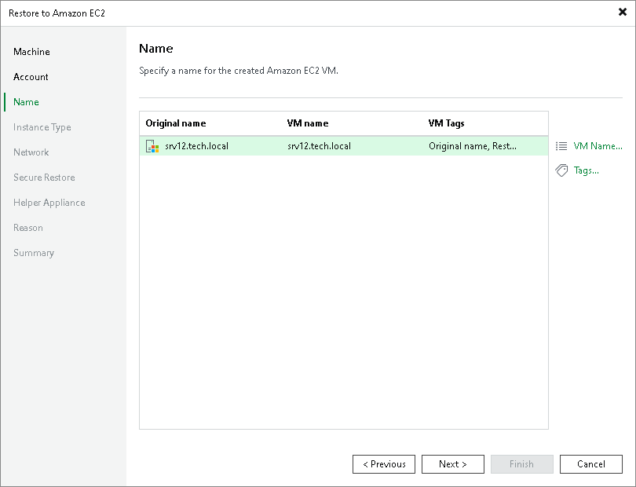
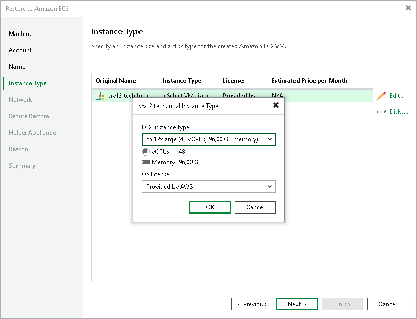
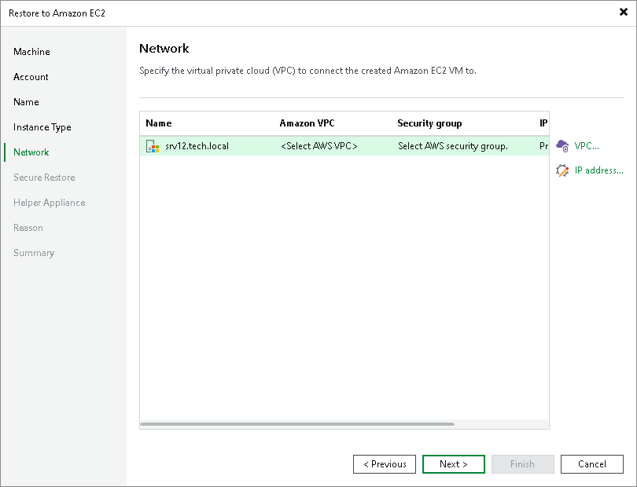
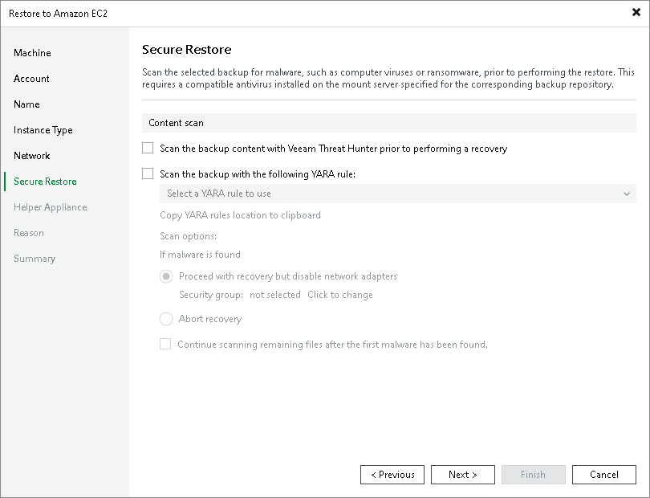
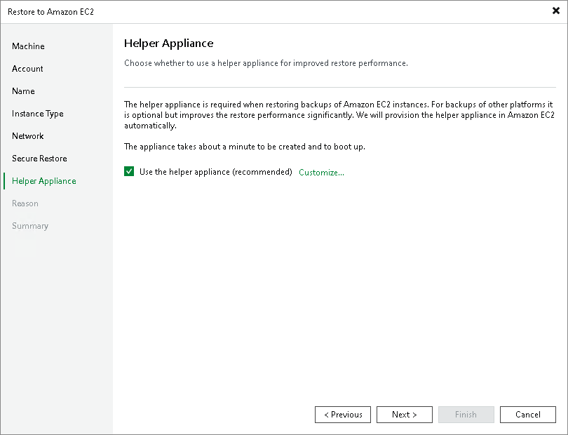

# Restoring Tenant Backups to Amazon EC2

The SP can restore machines from tenant backups stored in a cloud repository to a public cloud environment. This capability allows the SP to use tenant backups to recover workloads directly in Amazon Elastic Compute Cloud (Amazon EC2), rather than to the original on‑premises location. As a result, the SP can offer additional data protection scenarios, such as migration if the tenant decides to permanently move from an on-premises environment to a public cloud environment.

To use this functionality, the SP must make sure that the following conditions are met:

* To allow the SP to view tenant backups in the SP backup console, the tenant must select the Allow this Veeam Backup & Replication installation to be managed by the service provider check box when connecting to the SP. For details, see [Connecting to Service Providers](cloud_connect_sp.md).

|  |
| --- |
| Note |
| For Veeam Agent users, consider that to display on the SP side backups created by Veeam Agent in the standalone mode, a backup server connected to the SP with the Allow this Veeam Backup & Replication installation to be managed by the service provider option enabled is required. |

* Veeam Cloud Connect supports restore to Amazon EC2 from unencrypted backups only.

* Veeam Cloud Connect supports restore to Amazon EC2 for the following workloads:

* Backups of VMware Cloud Director VMs created by Veeam Backup & Replication.
* Backups of Microsoft Windows and Linux VMs created by Veeam Backup & Replication.
* Backups of Microsoft Hyper-V virtual machines created by Veeam Backup & Replication.
* Backups of Microsoft Windows machines created by [Veeam Agent for Microsoft Windows](https://helpcenter.veeam.com/docs/agentforwindows/userguide/overview.html?ver=13).
* Backups of Linux machines created by [Veeam Agent for Linux](https://helpcenter.veeam.com/docs/agentforlinux/userguide/overview.html?ver=13).
* Backups of Amazon EC2 instances created by [Veeam Backup for AWS](https://helpcenter.veeam.com/docs/vbaws/guide/welcome.html?ver=10).
* Backups of Microsoft Azure virtual machines created by [Veeam Backup for Microsoft Azure](https://helpcenter.veeam.com/docs/vbazure/guide/overview.html?ver=8.1).
* Backups of Google Compute Engine VM instances created by [Veeam Backup for Google Cloud](https://helpcenter.veeam.com/docs/vbgc/guide/welcome.html?ver=7).
* Backups of Nutanix AHV VMs created by [Veeam Backup for Nutanix AHV](https://helpcenter.veeam.com/docs/vbahv/userguide/overview.html?ver=9).
* Backups of oVirt VMs created by [Veeam Backup for OLVM and RHV](https://helpcenter.veeam.com/docs/vbrhv/userguide/overview.html?ver=6).
* Backups of Proxmox VE VMs created by [Veeam Backup for Proxmox VE](https://helpcenter.veeam.com/docs/vbproxmoxve/userguide/overview.html?ver=3).

This procedure description is specific for the Veeam Cloud Connect environment. This section describes only basic steps that you must take to restore a tenant backup to Amazon EC2. For details on how restore to the Amazon EC2 works, description of all options and limitations within the Veeam Backup & Replication infrastructure, see the [Restore to Amazon EC2](https://helpcenter.veeam.com/docs/vbr/userguide/restore_amazon.html?ver=13) section in the Veeam Backup & Replication User Guide.

Before starting the restore to Amazon EC2 operation, the SP must first disable the tenant account. To do that, complete the following steps:

1. In Veeam Backup & Replication on the SP backup server, open the Cloud Connect view.
2. In the inventory pane, click Tenants.
3. In the working area, right-click the tenant account and select Disable.

To learn more about this operation, see [Disabling and Enabling Tenant Accounts](cloud_connect_disable_account.md).

To restore tenant backup to Amazon EC2, do the following:

1. In Veeam Backup & Replication on the SP backup server, open the Home view.
2. Select the Backups node in the inventory pane. Expand the backup in the working area, select the necessary VM, select Entire VM and click Amazon EC2 on the ribbon or right-click the backup and select Restore entire VM and click Amazon EC2.

1. At the Machine step of the Restore to Amazon EC2 wizard, select the VM in the list, click Point on the right and select the necessary restore point.

1. At the Account step of the wizard, specify credentials of a user account that will be used to connect to AWS, region and a target data center.

1. At the Name step of the wizard, specify names and manage AWS tags for the restored workloads.

1. At the Instance Type step of the wizard, configure the instance for the restored workload, select which disks to restore and if necessary change their type.

1. At the Network step of the wizard, select to which Amazon Virtual Private Cloud (Amazon VPC) the restored workload must be connected. You can also specify a subnet and a security group - a virtual firewall for the restored EC2 instance.

1. At the Secure Restore step of the wizard, configure Veeam Backup & Replication to scan machine data with antivirus software and YARA rules before restoring the machine to the production environment.

1. At the Helper Appliance step of the wizard, specify helper appliance settings. A helper appliance is an auxiliary Linux-based instance used to upload disks of a backed-up workload to Amazon EC2.

For details on the helper appliance settings configuration, see the [Configure Helper Appliance](https://helpcenter.veeam.com/docs/vbr/userguide/restore_amazon_proxy.html?ver=13) section in the Veeam Backup & Replication User Guide.

1. At the Reason step of the wizard, specify the reason for future reference.
2. At the Summary step of the wizard, check the specified settings and click Finish.

After completing the restore operation, the SP must enable the tenant account. To do that, complete the following steps::

1. In Veeam Backup & Replication on the SP backup server, open the Cloud Connect view.
2. In the inventory pane, click Tenants.
3. In the working area, right-click the tenant account and select Disable.

To learn more about this operation, see [Disabling and Enabling Tenant Accounts](cloud_connect_disable_account.md).

