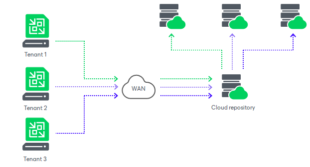

In this article

SP can use Veeam Backup & Replication to offer cloud repository as a service to their customers.

Cloud repositories have a multi-tenant architecture. Veeam Backup & Replication creates a storage abstraction layer and virtually partitions storage resources of a cloud repository. As a result, the SP can expose cloud repository resources to several tenants and store tenants’ data in the cloud in an isolated and segregated way. Veeam Backup & Replication establishes a secure channel to transfer tenant data to and from the cloud repository and offers data encryption capabilities to protect tenant data at rest.

All data protection and disaster recovery tasks targeted at the cloud repository are performed by tenants on their own. Tenants can set up necessary jobs themselves and perform tasks on Veeam backup servers deployed on their side. Tenants can perform the following operations:

* Back up virtual and physical machines to the cloud repository
* Copy backup files to the cloud repository
* Restore data from the cloud repository
* Perform file copy operations between the tenant side and the cloud repository (Manual operations only. Scheduled file copy jobs are not supported.)

Page updated 11/9/2023

Page content applies to build 13.0.1.1071
