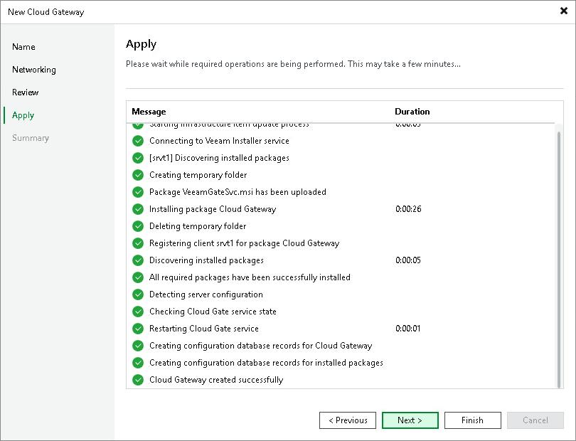

In this article

At the Apply step of the wizard, Veeam Backup & Replication will install the components on the cloud gateway server. Wait for the required operations to complete and click Next to continue.

Page updated 1/25/2024

Page content applies to build 13.0.1.1071
