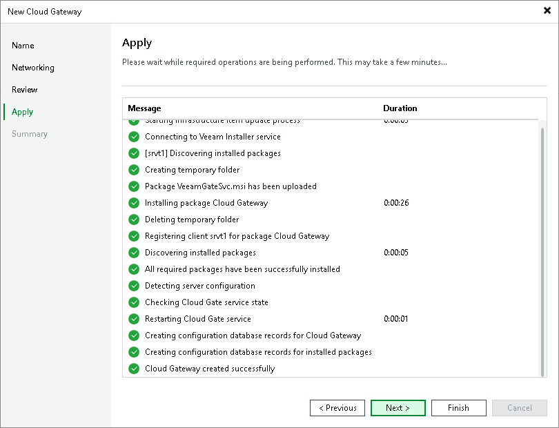

# Step 5. Assess Results

At the Apply step of the wizard, Veeam Backup & Replication will install the components on the cloud gateway server. Wait for the required operations to complete and click Next to continue.

Page updated 2026-08-04

