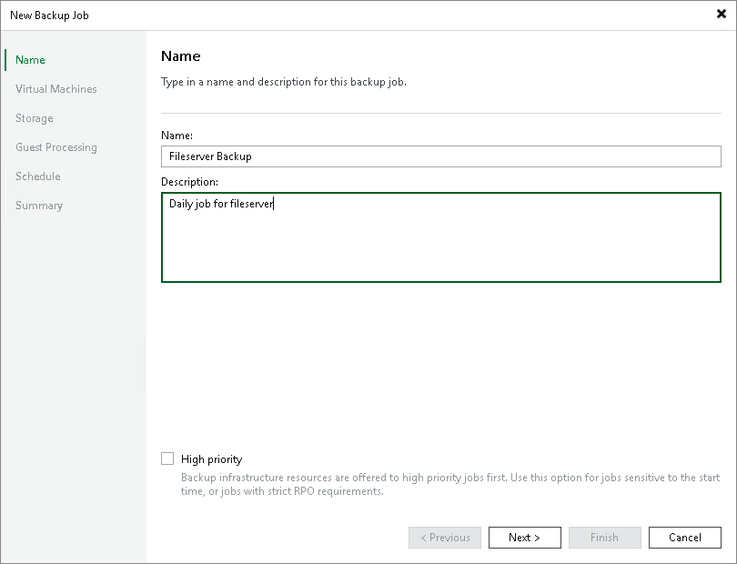
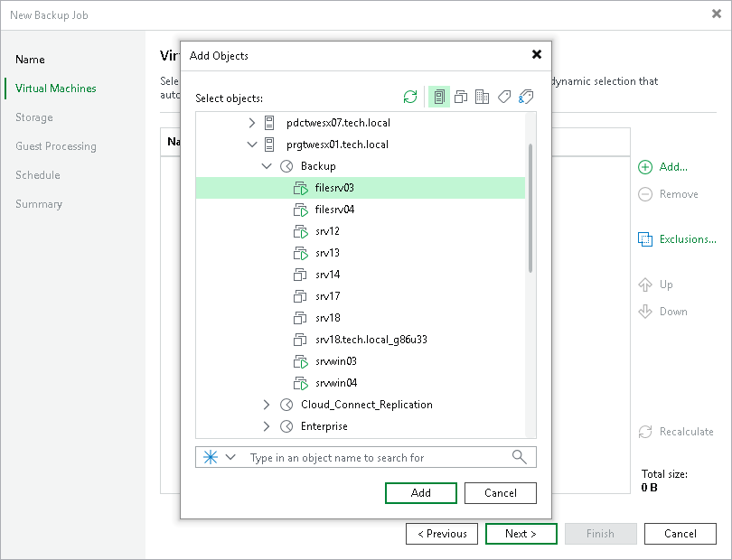
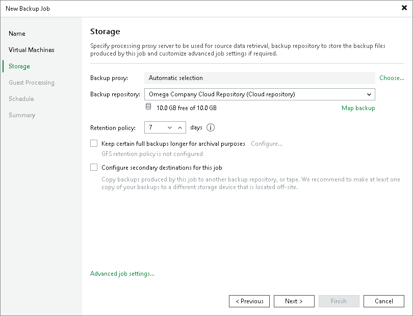
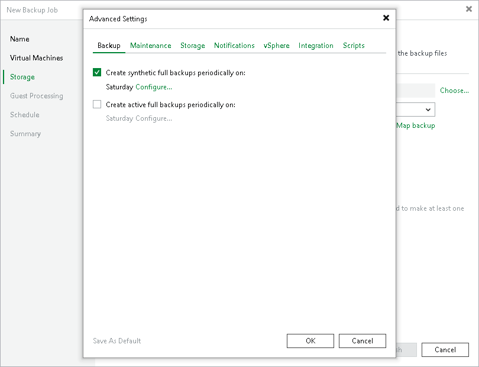
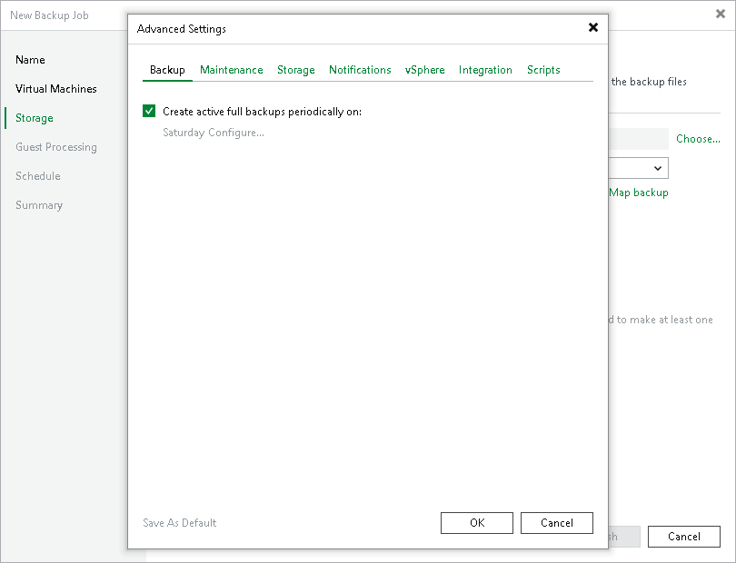
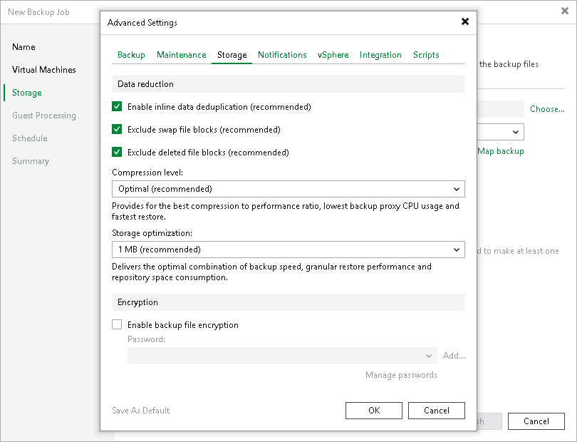
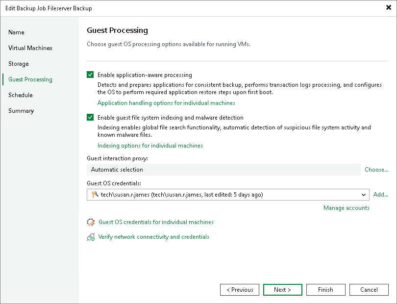
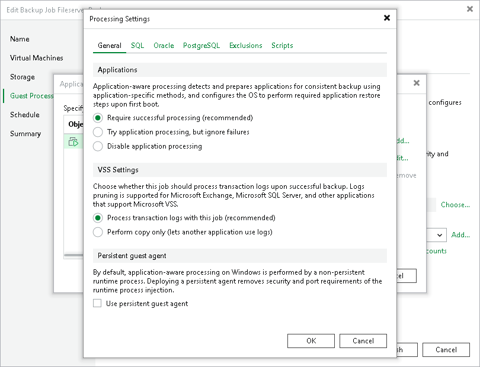
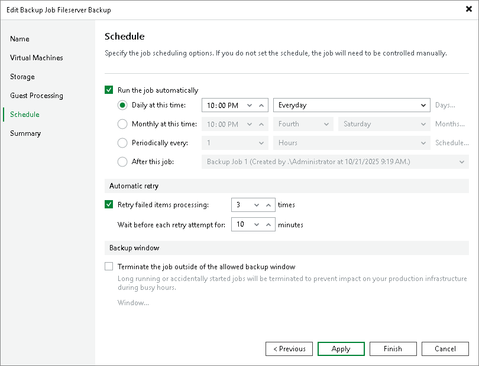

# Creating VM Backup Jobs

In Veeam Backup & Replication, backup is a job-driven process. To back up VMs, you must configure a backup job. The backup job defines how, where and when to back up VM data. One job can be used to process one or several VMs.

Veeam Backup & Replication backs up a VM image as a whole: it copies VM data at a block level unlike traditional backup tools that process guest OS files separately. Veeam Backup & Replication retrieves VM data from the source storage, compresses and deduplicates it and writes to the backup repository in Veeam’s proprietary format. You can use the image-level backup for all types of data restore scenarios: restore a full VM, VM guest OS files and folders, VM files and VM virtual disks (for VMware VMs only) from the backup file.

Veeam Backup & Replication conducts both full and incremental backup. During the first run of a backup job, Veeam Backup & Replication creates a full VM backup (VBK). All subsequent job cycles produce incremental backups: VIB if forward incremental backup is used or VRB if reversed incremental backup is used. The number of increments kept on disk depends on retention policy settings.

|  |
| --- |
| Note |
| This section describes only basic steps that you must take to create a VM backup job targeted at a cloud repository. To get a detailed description of all backup job settings, see the [Creating Backup Jobs](https://helpcenter.veeam.com/docs/vbr/userguide/backup_job.html?ver=13) section in the Veeam Backup & Replication User Guide. |

To create a backup job:

1. On the Home tab, click Backup Job and select Virtual machine > VMware vSphere or Virtual machine > Microsoft Hyper-V.
2. At the Name step of the wizard, specify a name and description for the backup job.

1. At the Virtual Machines step of the wizard, click Add and select VMs and VM containers that you want to back up. To quickly find the necessary object, use the search field at the bottom of the Add Objects window.

1. If you want to exclude VMs from the VM container or back up only specific VM disks, click Exclusions and specify what objects you want to exclude.
2. At the Storage step of the wizard, from the Backup repository list, select the cloud repository to which you plan to store the backup file.
3. In the Retention policy field, specify the number of days for which you want to store backup files on the cloud repository. If you want to use the GFS (Grandfather-Father-Son) retention scheme, you can also specify how weekly, monthly and yearly full backups must be retained.

1. Click Advanced job settings.
2. On the Backup tab, specify advanced backup settings.

* [If a simple backup repository is used as the cloud repository] Veeam Backup & Replication uses forward incremental backup method for backup chain creation. You can choose to periodically create synthetic full backups and active full backups. To create synthetic full backups periodically, select the Create synthetic full backups periodically on check box and specify when you want to create synthetic full backups. To create active full backups periodically, select the Create active full backups periodically on check box and specify when you want to create active full backups.

* [If an object storage repository is used as the cloud repository] Veeam Backup & Replication uses forward incremental backup method for backup chain creation. You can select the Create active full backups periodically on check box and specify when you want to create active full backups.

1. To encrypt the resulting backup file on the cloud repository, on the Storage tab, select the Enable backup file encryption check box. From the Password field, select a password that you want to use to encrypt the backup file. If you have not created a password beforehand, click Add or use the Manage passwords link to specify a new password.

You can select a Key Management System (KMS) server in the Password field. The KMS server must be added to Veeam Backup & Replication in advance. If you choose to use KMS keys for backup file encryption at this step of the wizard, Veeam Backup & Replication immediately starts communication with the KMS server to retrieve the encryption keys. To learn more, see the [Key Management System Keys](https://helpcenter.veeam.com/docs/backup/vsphere/kms.html?ver=120) section in the Veeam Backup & Replication User Guide.

1. To create a transactionally consistent backup of VMs, at the Guest Processing step of the wizard, select the Enable application-aware processing check box.
2. Click Add next to the Guest OS credentials list and specify credentials for a user account with local administrator privileges on the VM guest OS. By default, Veeam Backup & Replication uses the same credentials for all VMs added to the job. If some VM requires a different user account, click Guest OS credentials for individual machines and enter custom credentials for the necessary VM.

1. Click Application handling options for individual machines, select the necessary VM and click Edit. On the General tab, in the Applications section, specify the VSS behavior scenario:

+ Select Require successful processing if you want Veeam Backup & Replication to stop the backup process if any VSS errors occur.
+ Select Try application processing, but ignore failures if you want to continue the backup process even if VSS errors occur. This option is recommended to guarantee completion of the job. The created backup image will not be transactionally consistent, but crash consistent.
+ Select Disable application processing if you do not want to enable quiescence for the VM at all.

1. [For Microsoft SQL, Oracle and PostgreSQL VMs] In the VSS Settings section, specify how Veeam Backup & Replication must handle database logs:

+ Select Process transaction logs with this job if you want Veeam Backup & Replication to handle Microsoft SQL Server transaction logs or Oracle archived logs. With this option enabled, Veeam Backup & Replication will offer a choice of log processing options on the SQL and Oracle tabs.
+ Select Perform copy only if you use native application means or a third-party tool to process transaction logs. Veeam Backup & Replication will create a copy-only backup for the selected VM. The copy-only backup preserves a chain of full/differential backup files and transaction logs. To learn more, see [Microsoft documentation](https://msdn.microsoft.com/en-us/library/ms191495.aspx).

|  |
| --- |
| Note |
| You cannot enable log backup options in the properties of a backup job targeted at the cloud repository. For Microsoft SQL Server, you can enable transaction log truncation options only. For Oracle, you can choose whether to delete archived logs.  If you want to store database log backups in the cloud repository, you can do the following:   1. Configure a backup job targeted at a regular backup repository. 2. Configure a backup copy job targeted at a cloud repository. In the properties of the backup copy job, select the Immediate copy option, select the job created at the step 1 as a source backup job and enable the Include database transaction log backups option. For details, see [Creating Backup Copy Jobs](cloud_connect_backup_copy.md). |

1. At the Schedule step of the wizard, select the Run the job automatically check box and specify the necessary scheduling settings for the job. If you do not select this check box, you will have to run the backup job manually to create a backup file in the cloud.

1. At the Summary step of the wizard, select the Run the job when I click Finish check box if you want to start the created job right after you complete working with the wizard.
2. Click Finish.

