In this article

Veeam Backup & Replication lets you create a Veeam Agent backup job targeted at a cloud repository. You can use the Veeam backup console to create Veeam Agent backup jobs of the following types:

* Veeam Agent backup job managed by the backup server
* Backup policy, or Veeam Agent backup job managed by Veeam Agent

Before you configure a Veeam Agent backup job, you must deploy Veeam Agent on computers whose data you want to back up. To learn more, see the [Working with Protection Groups](https://helpcenter.veeam.com/docs/vbr/userguide/protection_group_tasks.html?ver=13) section in the Veeam Backup & Replication User Guide.

|  |
| --- |
| Note |
| Consider the following:   * This section describes the procedure of creating a backup job for Veeam Agent managed by Veeam Backup & Replication. For information about how to create a backup job for Veeam Agent operating in the standalone mode, see the [Creating Backup Jobs](https://helpcenter.veeam.com/archive/agentforwindows/13/userguide/backup_job_create.html) section in the Veeam Agent for Microsoft Windows User Guide.  * This section describes only basic steps that you must take to create a Veeam Agent backup job targeted at a cloud repository. To get a detailed description of all Veeam Agent backup job settings, see the [Creating Veeam Agent Backup Jobs](https://helpcenter.veeam.com/docs/vbr/userguide/agent_job_create.html?ver=13) section in the Veeam Backup & Replication User Guide. * The procedure of configuring a Veeam Agent backup job differs depending on the type of machines that the job will process: Microsoft Windows machines, Linux machines or Mac machines. Backup of IBM AIX machines and Oracle Solaris machines to a cloud repository is not supported. This section describes the procedure for a backup job that includes Microsoft Windows machines; however, the description focuses on the steps that are identical for all supported types of machines. * For backup to a cloud repository in the Veeam Agent management scenario, Veeam Backup & Replication uses managed subtenant accounts. For more information, see the [Managed Subtenant Account](cloud_connect_subtenant_account.md#managed) section in this guide and the [Backup to Veeam Cloud Connect Repository](https://helpcenter.veeam.com/docs/vbr/userguide/agents_cloud_connect.html?ver=13) section in the Veeam Backup & Replication User Guide. |

To create a Veeam Agent backup job:

1. On the Home tab, click Backup Job and select Windows computer or Linux computer.
2. At the Job Mode step of the New Agent Backup Job wizard, specify protection settings for the backup job:

1. In the Type field, select the type of protected computers whose data you want to back up with Veeam Agents: Workstation, Server or Failover cluster.

|  |
| --- |
| Note |
| The Failover cluster option is not available for backup jobs that include Linux computers. |

1. If you selected the Server option in the Type field, in the Mode field, select the job mode:

* Managed by backup server — select this option if you want to configure the Veeam Agent backup job managed by the backup server. The backup job will run on the backup server in the similar way as a regular job for VM data backup.
* Managed by agent — select this option if you want to configure the backup policy. The backup policy acts as a saved template that describes configuration of individual Veeam Agent backup jobs that run on protected computers.

|  |
| --- |
| Note |
| The Managed by backup server option is not available for backup jobs that include Mac computers. |

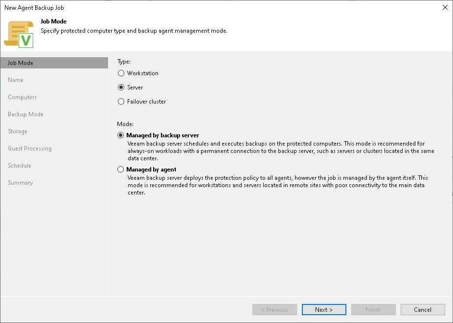

1. At the Name step of the wizard, specify a name and description for the backup job.

1. At the Computers step of the wizard, click Add and select one or more protection groups or individual computers whose data you want to back up. To quickly find the necessary object, use the search field at the bottom of the Select Objects window.

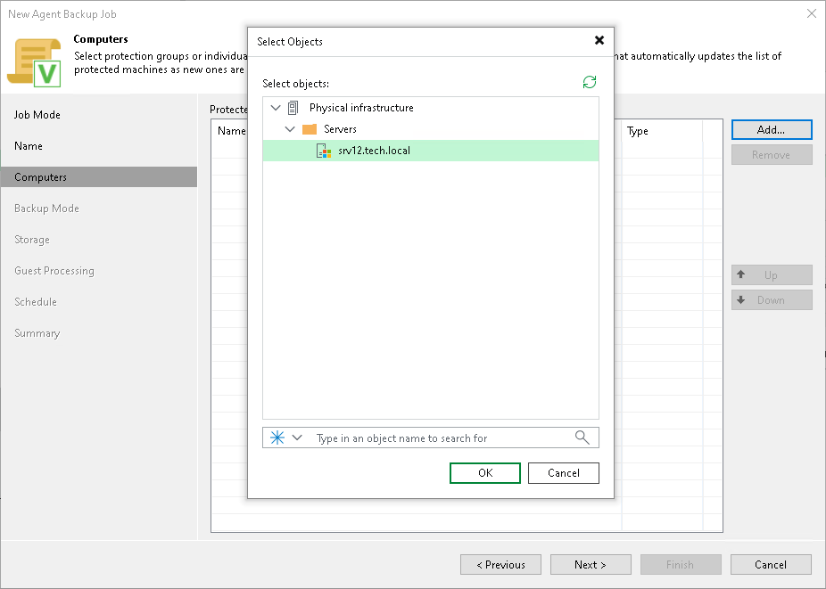

1. At the Backup Mode step of the wizard, select the backup mode. You can select one of the following options:

* Entire computer — select this option if you want to create a backup of the entire computer image. When you restore data from such backup, you will be able to recover the entire computer image as well as data on specific computer volumes: files, folders, application data and so on.
* Volume level backup — select this option if you want to create a backup of specific computer volumes, for example, all volumes except the system one. When you restore data from such backup, you will be able to recover data on these volumes only: files, folders, application data and so on.
* File level backup — select this option if you want to create a backup of individual folders on your computer.

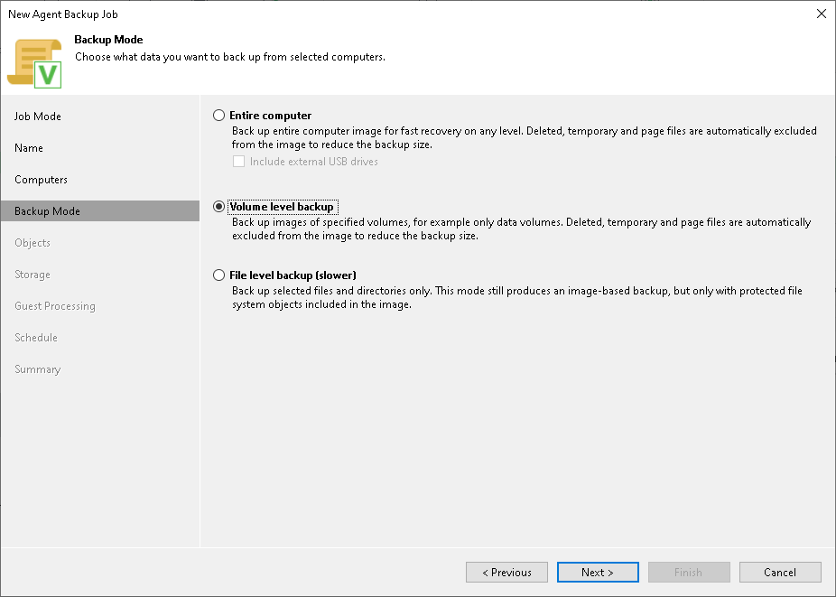

1. If you chose the Volume level backup or File level backup option at the Backup Mode step of the wizard, at the Objects step of the wizard, specify the backup scope for the Veeam Agent backup job.

* For volume-level backup, specify what volumes you want to include in the backup. You can include in the backup operating system data or specific volumes. You can also include in the backup all volumes except for the volume that contains operating system data or selected volumes.

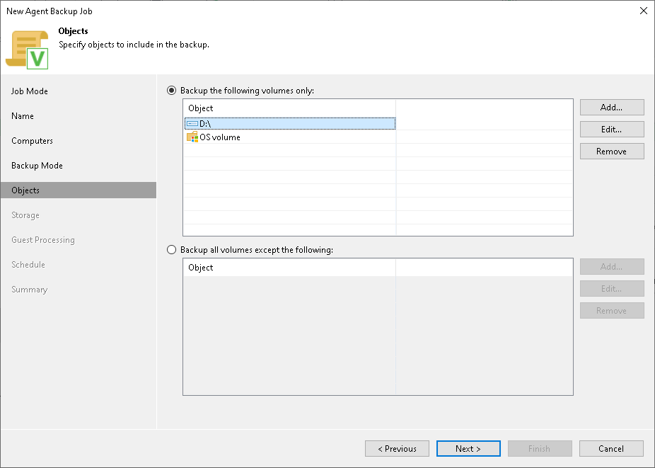

* For file-level backup, specify what folders with files or entire volumes you want to include in the backup. You can include in the backup operating system data, personal files or specific folders or volumes.

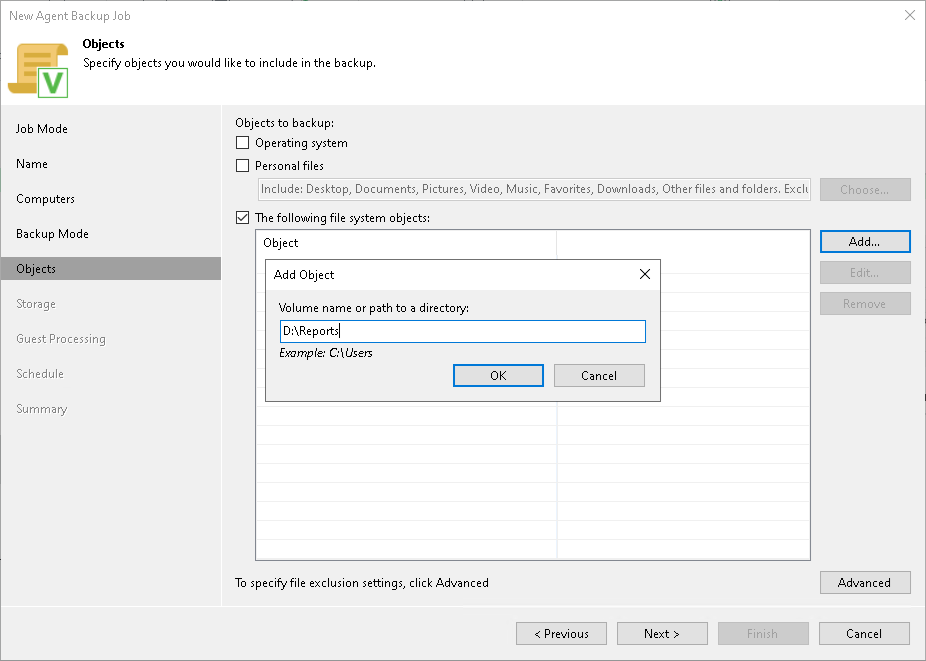

1. [For a backup policy] If you selected the Managed by agent option at the Job Mode step of the wizard, at the Destination step of the wizard, select the Veeam Cloud Connect repository option.

|  |
| --- |
| Note |
| If you selected the Managed by backup server option at the Job Mode step of the wizard, this step will not be displayed. You will immediately proceed to the Storage step of the wizard. |

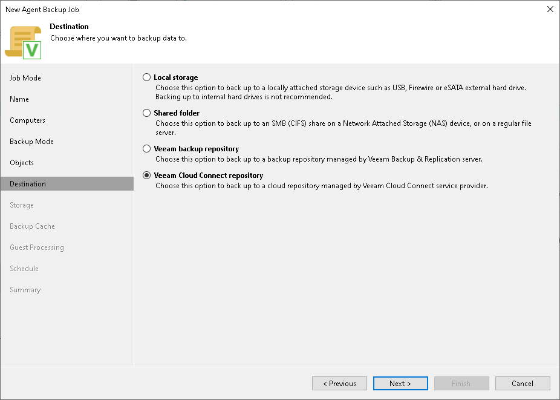

1. At the Storage step of the wizard, from the Backup repository list, select the cloud repository to which you plan to store backup files.
2. In the Retention policy field, specify the number of days for which you want to store backup files on the cloud repository. If you want to use the GFS (Grandfather-Father-Son) retention scheme, you can also specify how weekly, monthly and yearly full backups must be retained.

* For a backup job managed by the backup server:

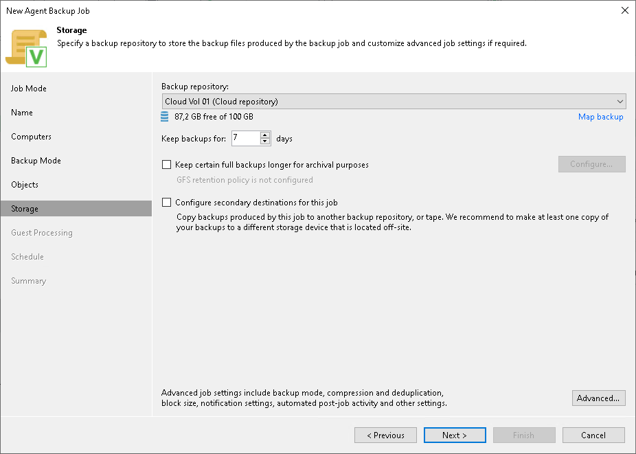

* For a backup policy:

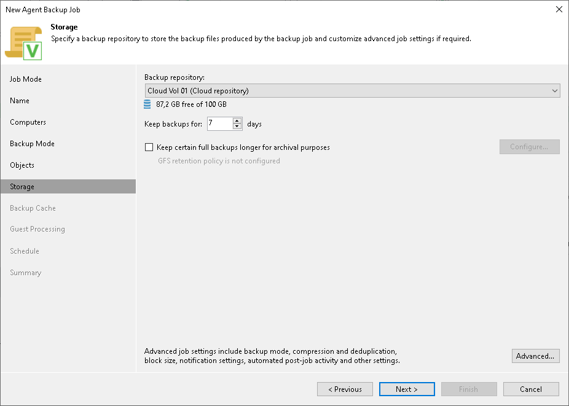

1. Click Advanced.
2. To encrypt the resulting backup file on the cloud repository, on the Storage tab, select the Enable backup file encryption check box. From the Password field, select a password that you want to use to encrypt the backup file. If you have not created a password beforehand, click Add or use the Manage passwords link to specify a new password.

[For a backup job managed by the backup server] You can select a Key Management System (KMS) server in the Password field. The KMS server must be added to Veeam Backup & Replication in advance. If you choose to use KMS keys for backup file encryption at this step of the wizard, Veeam Backup & Replication immediately starts communication with the KMS server to retrieve the encryption keys. To learn more, see the [Key Management System Keys](https://helpcenter.veeam.com/docs/vbr/userguide/kms.html?ver=13) section in the Veeam Backup & Replication User Guide.

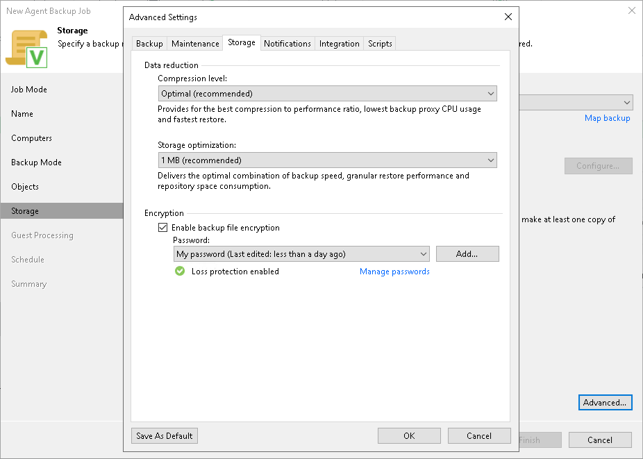

1. [For a backup policy] If you want to enable the backup cache for the backup policy, at the Backup Cache step of the wizard, specify backup cache settings.

|  |
| --- |
| Note |
| If you selected the Managed by backup server option at the Job Mode step of the wizard, this step will not be displayed. You will immediately proceed to the next step of the wizard. |

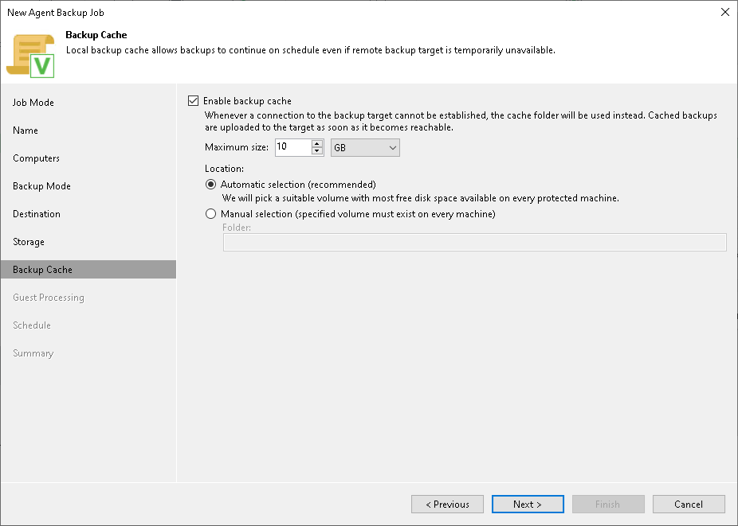

1. If you selected the Server or Failover cluster option at the Job Mode step of the wizard, you can enable application-aware processing settings at the Guest Processing step of the wizard. Available guest OS processing settings differ for backup jobs that process Microsoft Windows machines and backup jobs for Linux machines.

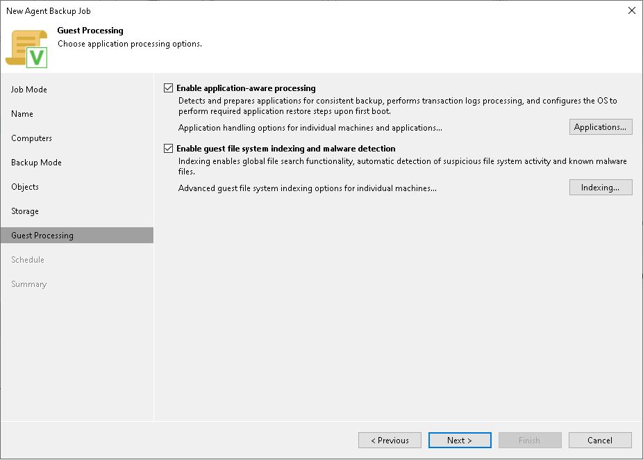

1. At the Schedule step of the wizard, specify the schedule according to which you want to perform backup:

* If you selected the Server or Failover cluster option at the Job Mode step of the wizard, select the Run the job automatically check box and specify the necessary scheduling settings for the job. If you do not select this check box, you will have to run the backup job manually to create a backup file in the cloud.

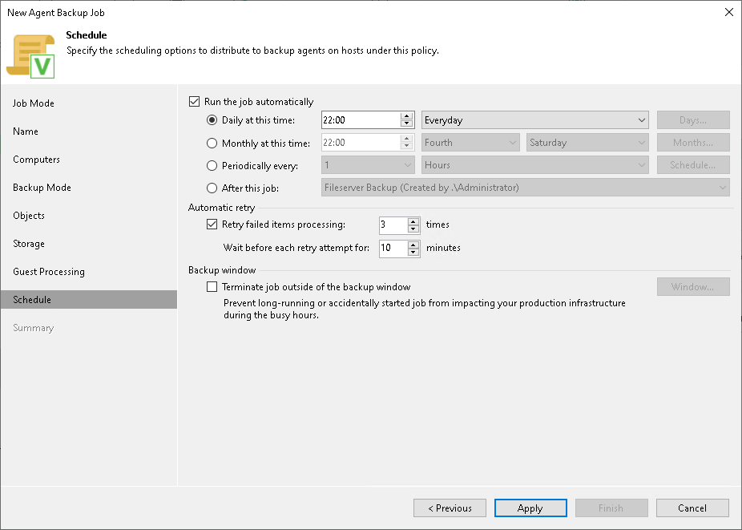

* If you selected the Workstation option at the Job Mode step of the wizard, you can specify time and days when the backup job must start, as well as settings for events that trigger the backup job launch.

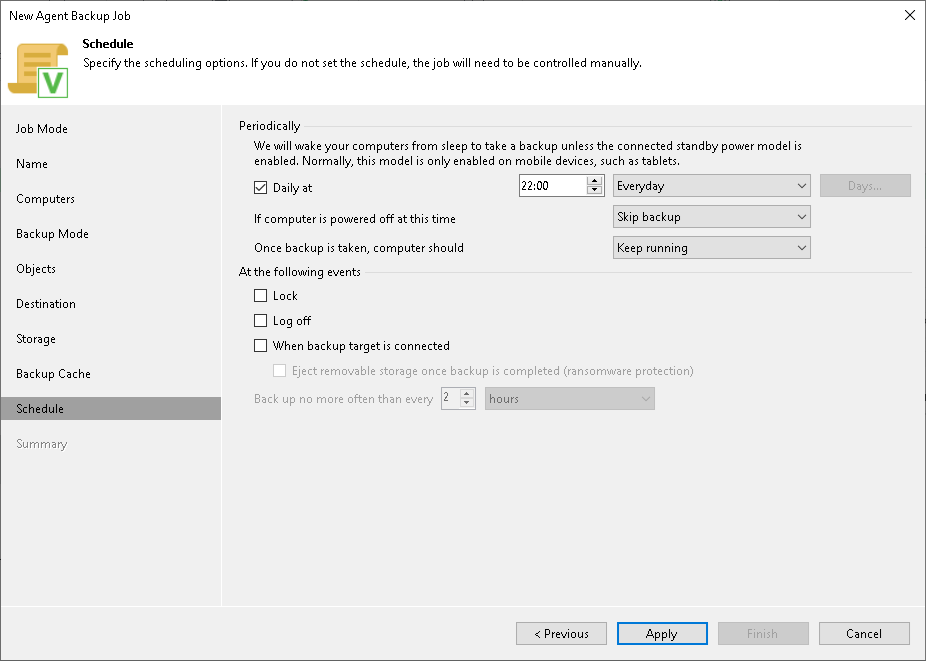

1. [For a backup job managed by the backup server] At the Summary step of the wizard, select the Run the job when I click Finish check box if you want to start the created job right after you complete working with the wizard.
2. Click Finish.

Page updated 11/14/2025

Page content applies to build 13.0.1.1071
