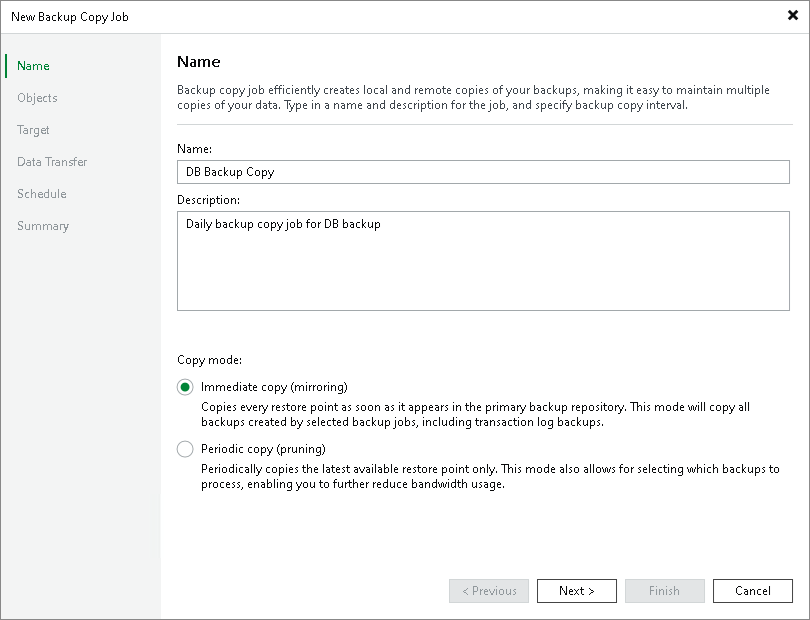
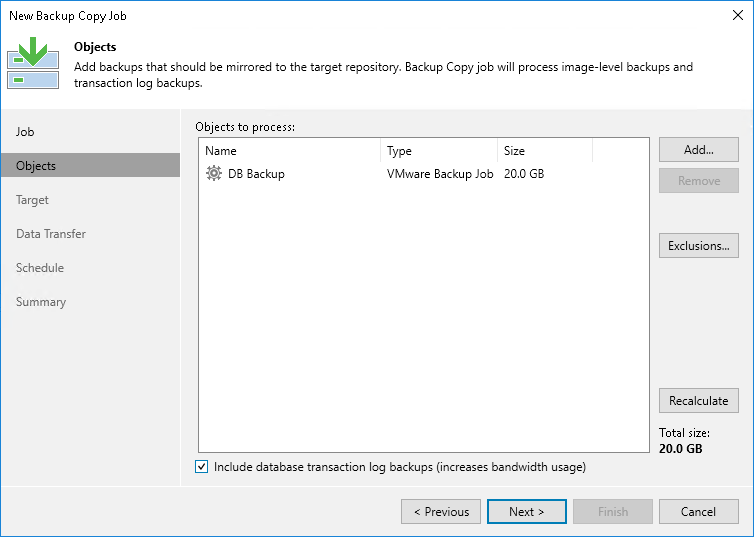
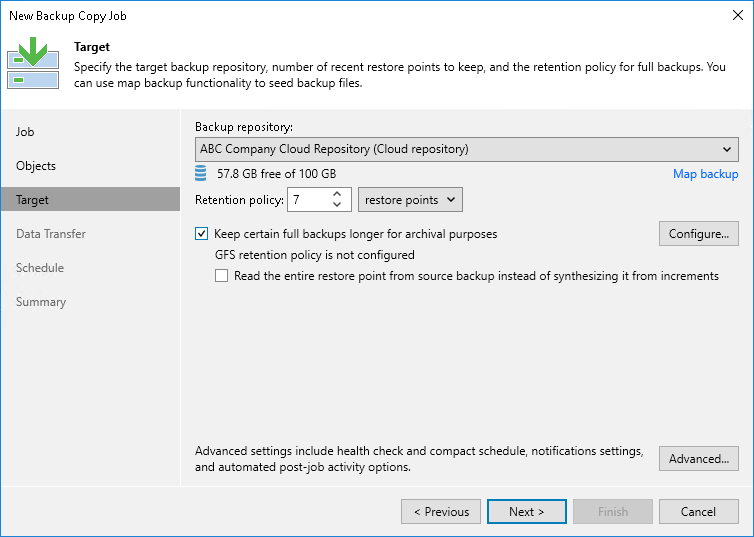
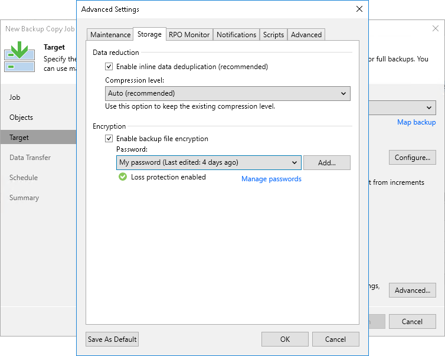
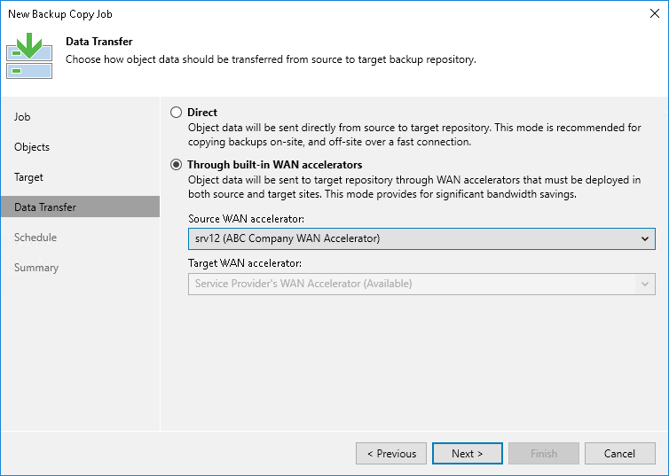
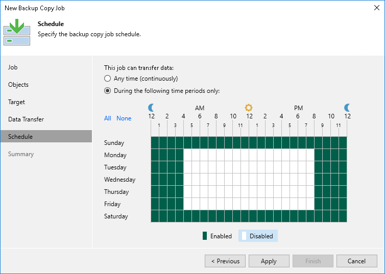

In this article

To follow the 3–2–1 backup best practice, you can configure a backup copy job and target it at the cloud repository. Backup copy jobs allow you to create several instances of the same backup file in different locations, onsite or offsite. For example, you can configure a backup job to create a VM backup on the local backup repository, and use the backup copy job to copy the created VM backup from the local backup repository to the cloud repository.

To learn more about backup copy in the Veeam Cloud Connect Backup scenario, see [Backup Copy to Cloud Repository](cc_backup_copy.md).

|  |
| --- |
| Note |
| This section describes only basic steps that you must take to create a backup copy job. To get a detailed description of all backup copy job settings, see the [Creating Backup Copy Jobs for VMs and Physical Machines Using Console](https://helpcenter.veeam.com/docs/vbr/userguide/backup_copy_create.html?ver=13) section in the Veeam Backup & Replication User Guide. |

To create a backup copy job:

1. On the Home tab, click Backup Copy.
2. At the Job step of the wizard, specify a name and description for the backup copy job and select the backup copy mode:

* Select Immediate copy to copy new restore points and, if required, database log backups as soon as they appear in the source backup repository.

* Select Periodic copy to copy the most recent restore points according to a specified schedule.

1. At the Objects step of the wizard, specify what data Veeam Backup & Replication will copy to the cloud repository.

* Click Add and select From jobs to select backup jobs that contain VMs or physical machines whose restore points you want to copy from the local backup repository to the cloud repository.

To quickly find the necessary object, use the search field at the bottom of the Select Jobs window.

* Click Add and select From repositories to select backup repositories that contain backups of VMs or physical machines that you want to copy to the cloud repository.

To quickly find the necessary object, use the search field at the bottom of the Select Repository window.

1. [For the immediate copy mode] If you enabled database log backup for the source backup jobs and want to copy log backups to the cloud repository, select the Include database transaction log backups check box.

1. If you want to exclude specific VMs from a backup job or backup repository added to the job, click Exclusions and specify what objects you want to exclude.
2. At the Target step of the wizard, from the Backup repository list, select the cloud repository to which you want to copy the backup.
3. To use the GFS (Grandfather-Father-Son) retention scheme, select the Keep certain full backups longer for archival purposes check box and click Configure. In the Configure GFS window, define when to create full backups for archival purposes and how long to keep these backups.

It is recommended that you enable GFS retention settings for the backup copy job if the SP has enabled the deleted backups protection option in the properties of your tenant account. This way, Veeam Backup & Replication will be able to protect backups created by the job against an attack when a hacker reduces the job retention policy and creates a few incremental backups to remove backed-up data from the backup chain.

If you do not enable GFS retention settings for the backup copy job, the job will complete with a warning. In the job statistics window, Veeam Backup & Replication will display a notification advising to use the GFS retention scheme for the job.

1. To encrypt the resulting backup file on the cloud repository, click Advanced. On the Storage tab, select the Enable backup file encryption check box. From the Password field, select a password that you want to use to encrypt the backup file. If you have not created a password beforehand, click Add or use the Manage passwords link to specify a new password.

You can select a Key Management System (KMS) server in the Password field. The KMS server must be added to Veeam Backup & Replication in advance. If you choose to use KMS keys for backup file encryption at this step of the wizard, Veeam Backup & Replication immediately starts communication with the KMS server to retrieve the encryption keys. To learn more, see the [Key Management System Keys](https://helpcenter.veeam.com/docs/vbr/userguide/kms.html?ver=13) section in the Veeam Backup & Replication User Guide.

1. At the Data Transfer step of the wizard, specify a data transfer path for the backup copy job:

* If the cloud repository does not use WAN accelerators, select Direct.
* If the cloud repository uses WAN accelerators, select Through built-in WAN accelerators. In the Source WAN accelerator field, select the WAN accelerator that you have configured on your side.

1. At the Schedule step of the wizard, specify schedule settings for the backup copy job.

* [For the immediate copy mode] Define the time span in which the backup copy job must not transport data over the network. You can use this option, for example, to disable the backup copy job during production hours to avoid producing workload on the production environment.

* [For the periodic copy mode] Select the Run the job automatically check box and specify the necessary scheduling settings for the job. If you do not select this check box, you will have to run the backup copy job manually to create a copy of your data in the cloud.

1. At the Summary step of the wizard, select the Enable the job when I click Finish check box (for the immediate copy mode) or Run the job when I click Finish check box (for the periodic copy mode) if you want to start the created job right after you complete working with the wizard.
2. Click Finish.

Page updated 11/11/2025

Page content applies to build 13.0.1.1071
