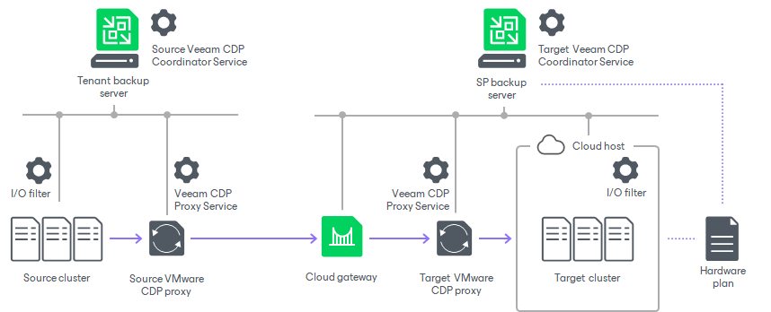
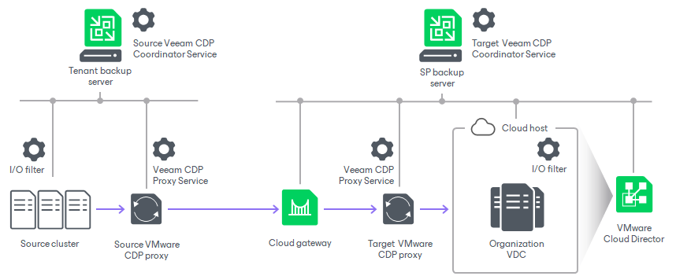

# Veeam Cloud Connect CDP Scenarios

Veeam Cloud Connect offers the following CDP scenarios.

Scenario 1. CDP to VMware vSphere

In this scenario, the SP allocates computing, storage and network resources for tenant CDP replicas on a VMware vSphere cluster and provides them to the tenant through a hardware plan.

The tenant connects to the SP using credentials of the standalone tenant account obtained from the SP. After that, the tenant can create CDP policies targeted at the cloud host. Tenant data will be replicated from the source VMware vSphere host or source workload to the cloud host that has VMware vSphere resources as a back end.

This scenario is similar to the [regular snapshot-based replication](cloud_replication.md) in Veeam Cloud Connect.

Scenario 2. CDP to VMware Cloud Director

In this scenario, the SP provides replication resources for tenant CDP replicas through organization VDCs configured in VMware Cloud Director.

The tenant connects to the SP using credentials of the VMware Cloud Director tenant account obtained from the SP. After that, the tenant can create CDP policies targeted at the cloud host. Tenant data will be replicated from the source VMware vSphere host or source workload to the cloud host that has VMware Cloud Director resources as a back end.

This scenario is similar to [VMware Cloud Director Support](cloud_vcloud_director.md).

