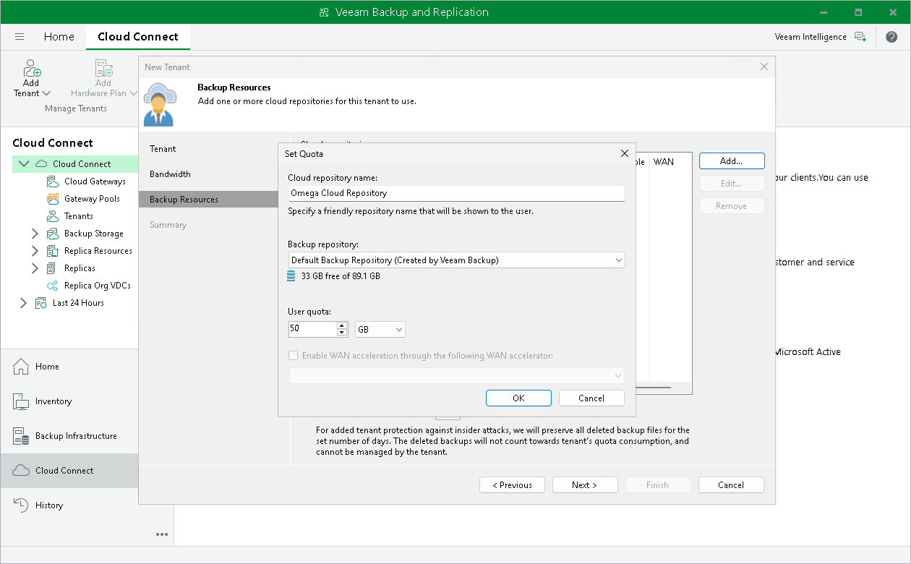

# Configuring Cloud Repositories

You can configure one or several backup repositories in your backup infrastructure and use them as cloud repositories.

A cloud repository is a regular backup repository configured on the SP side. When the SP creates a tenant account, the SP can assign a storage quota (allocates some amount of storage space) on this backup repository for the tenant. The tenant can be assigned different quotas on different backup repositories. As soon as the tenant connects to the SP, Veeam Backup & Replication retrieves information about all quotas for this tenant and displays a list of available cloud repositories in the tenant backup infrastructure.

You can use the following types of backup repositories as cloud repositories:

* Microsoft Windows server with a local or directly attached storage
* Linux server with local, directly attached or mounted NFS storage
* SMB (CIFS) or NFS shared folder
* Deduplicating storage appliance: Dell Data Domain, ExaGrid and Quantum DXi
* Scale-out backup repository

* Object storage: S3 compatible, Amazon S3, IBM Cloud, Microsoft Azure and Wasabi

To learn more, see [Backup to Object Storage](cc_object_storage.md).

The configuration process for backup repositories in the Veeam Cloud Connect infrastructure does not differ from the same process in the regular Veeam backup infrastructure. To learn more, see the following sections in the Veeam Backup & Replication User Guide:

* [Adding Microsoft Windows Repository](https://helpcenter.veeam.com/docs/vbr/userguide/repo_add.html?ver=13)
* [Adding Scale-Out Backup Repository](https://helpcenter.veeam.com/docs/vbr/userguide/sobr_add.html?ver=13)
* [Adding Object Storage Repositories](https://helpcenter.veeam.com/docs/vbr/userguide/new_object_storage.html?ver=13)

|  |
| --- |
| Important |
| When the SP exposes a new simple backup repository as a cloud repository, the SP should make sure that the location of this repository does not appear to be a subfolder of another backup repository location. For example, if the SP has already specified the E:\Backups folder as a location of a backup repository, the SP must not configure other backup repositories in the following locations: E:\Backups\Tenants, E:\Backups\Cloud, and so on. After a tenant or the SP performs a rescan operation for a backup repository configured in this way, information about tenant backups in the configuration database on the SP backup server will become corrupted. |

|  |
| --- |
| Note |
| Veeam Backup & Replication does not apply the Limit maximum concurrent tasks option to backup repositories used as cloud repositories. For Veeam Cloud Connect Backup, the maximum allowed number of concurrent tasks is defined per tenant in the properties of the tenant account. For details, see [Specify Bandwidth Settings](cloud_connect_user_throttling.md). |

Related Concepts

[Cloud Repository](cloud_connect_repository.md)

