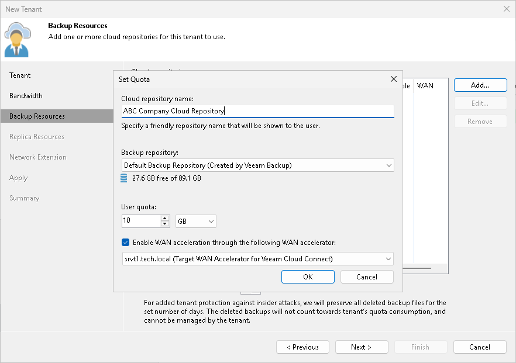
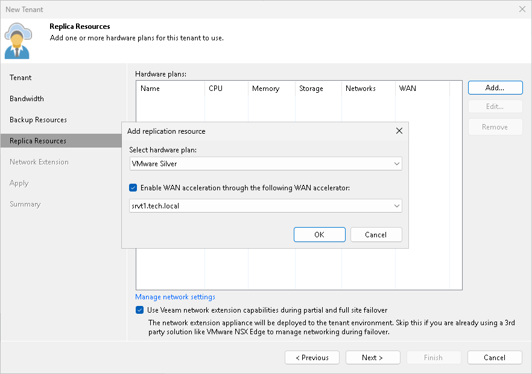

# Configuring Target WAN Accelerators

To optimize VM traffic going to the Veeam Cloud Connect infrastructure during the backup copy and replication jobs, the SP and tenants can configure WAN accelerators on their sides.

WAN accelerators in the Veeam Cloud Connect infrastructure must be configured in the following way:

* The source WAN accelerator is configured on the tenant side. Every tenant who plans to work with the cloud repository and cloud hosts using WAN accelerators must configure at least one WAN accelerator on their side.
* The target WAN accelerator is configured on the SP side.

|  |
| --- |
| Note |
| Veeam Backup & Replication does not use tenant backups to populate global cache on the SP side. |

When the SP creates a tenant account, the SP can define if the tenant should be able to use a WAN accelerator deployed on the SP side:

* For backup copy jobs targeted at the cloud repository

* For replication jobs targeted at the cloud host

As soon as the tenant connects to the SP, Veeam Backup & Replication retrieves the following information to identify if cloud resources available to this tenant can or cannot use WAN acceleration:

* Information about all quotas on cloud repositories assigned to the tenant
* Information about all cloud hosts provided to the tenant through hardware plans

If the cloud repository and cloud host can use WAN acceleration, the tenant can configure a source WAN accelerator on the tenant side and create backup copy and replication jobs that will work using WAN accelerators.

The configuration process for WAN accelerators in the Veeam Cloud Connect infrastructure is the same as in a regular Veeam backup infrastructure. To learn more, see the [Adding WAN Accelerators](https://helpcenter.veeam.com/docs/vbr/userguide/wan_add.html?ver=13) section in the Veeam Backup & Replication User Guide.

Related Concepts

[WAN Accelerators](cloud_connect_wan.md)

