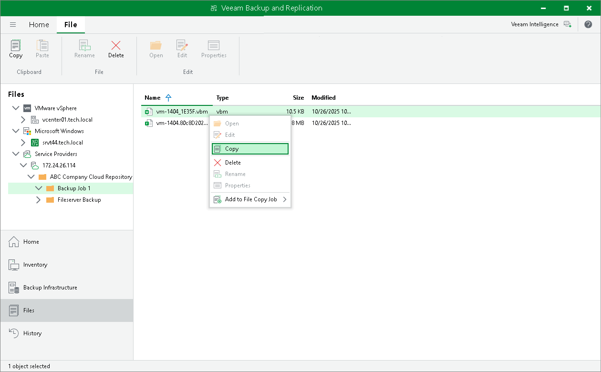

In this article

You can manually copy backup files from the cloud repository to any host or server in your backup infrastructure.

Before you begin the copying operation, make sure that the target host or server is added to the backup infrastructure.

To copy backup files:

1. Open the Files view.
2. In the inventory pane, expand the file tree of the cloud repository under the Service Providers node.
3. Right-click backup files that you want to copy and select Copy.
4. In the inventory pane, expand the file tree of the target server or host.
5. Right-click a destination folder and select Paste.

You can also use a drag-n-drop operation to copy backup files from the cloud repository.

|  |
| --- |
| Note |
| You cannot copy backup files from a cloud repository that uses a scale-out backup repository as a back end. To learn more, see [Scale-Out Backup Repositories Used as Cloud Repositories](cloud_connect_limitations.md#scale-out). |

Page updated 6/19/2024

Page content applies to build 13.0.1.1071
