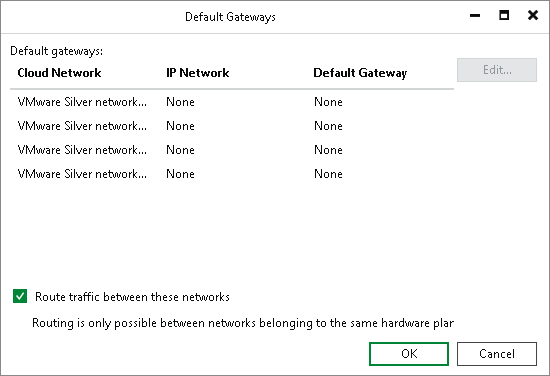
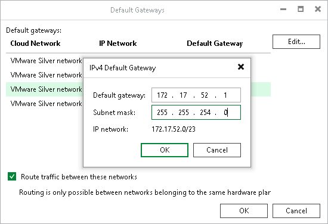
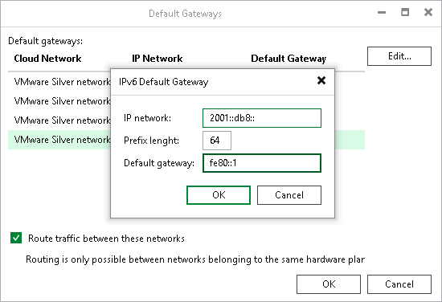

In this article

After full site failover, Veeam Backup & Replication uses the network extension appliance on the cloud host as a default gateway between a VM replica network and external networks. To route traffic that goes to and from VM replicas, the network extension appliance uses network settings of the default gateway in the production VM network.

During the first run of the replication job targeted at the cloud host, Veeam Backup & Replication [detects network settings](cloud_network_mapping.md) of replicated VMs and automatically saves information about default gateways that are used in every detected production network. You can check and, if necessary, edit default gateway settings in the Veeam Backup & Replication console. The specified settings will be used by the network extension appliance after failover.

When you specify the default gateway, Veeam Backup & Replication saves its settings in the Veeam Backup & Replication database on the SP side. After full site failover, Veeam Backup & Replication assigns the specified default gateway settings to the network extension appliance on the cloud host. As a result, VM replicas on the cloud host communicate to the internet in the same way as VMs in the production site.

Network extension appliance can also route traffic between several networks provided for VM replicas through the same hardware plan.

To manage default gateways:

1. Open the Backup Infrastructure view.
2. In the inventory pane, click the Service Providers node.
3. In the working area, select the service provider and click Manage Gateways on the ribbon or right-click the service provider and select Manage default gateways.
4. In the Default Gateways window, select the virtual cloud network provided for your VM replicas through the hardware plan and click Edit.

1. [For IPv4 networks] In the IPv4 Default Gateway window, specify the IP address of the default gateway that is used in your production site and subnet mask of the production network, and click OK.

1. [For IPv6 networks] In the IPv6 Default Gateway window, specify the production IPv6 network, prefix length and IP address of the default gateway, and click OK.

1. Select the Route traffic between these networks option if the SP subscribed you to a hardware plan with several networks available to your VM replicas and you want Veeam Backup & Replication to route traffic between these networks. This may be useful if your production site runs multiple interdependent VMs connected to several networks.
2. Click OK.

Page updated 11/9/2023

Page content applies to build 13.0.1.1071
