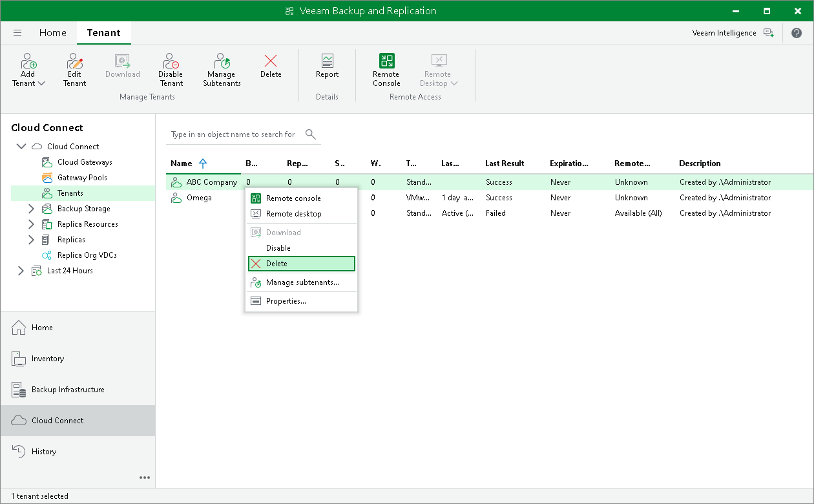

In this article

The SP can delete a tenant account at any time, for example, if the tenant no longer uses resources of the cloud repository.

When the SP deletes a tenant account, Veeam Backup & Replication disables this account and removes it. The tenant account is removed permanently. The SP cannot undo this operation.

When the SP deletes a tenant account, Veeam Backup & Replication displays a warning prompting whether to delete tenant backup data. The SP can choose to delete tenant backups automatically along with the tenant account. Alternatively, the SP can let tenant backup data remain intact in the cloud repository and delete it later manually.

In contradiction to backup data, Veeam Backup & Replication processes VM replicas on the cloud host according to the following rules:

* If a VM replica is powered off at the time when the SP deletes the tenant account, Veeam Backup & Replication unregisters the VM replica on the cloud host and deletes actual replica files from the datastore or volume.
* If a VM replica was powered on as part of a failover operation before the SP deletes the tenant account, Veeam Backup & Replication keeps the VM replica intact on the cloud host.
* If a VM replica was powered on manually before the SP deletes the tenant account, Veeam Backup & Replication powers off the VM replica, unregisters the VM replica on the cloud host and deletes actual replica files from the datastore or volume.

If the cloud repository and cloud host work using WAN accelerators, when the SP deletes a tenant account, Veeam Backup & Replication also deletes data for this tenant from the global cache on the target WAN accelerator.

To delete a tenant account:

1. Open the Cloud Connect view.
2. In the inventory pane, click the Tenants node.
3. In the working area, select the necessary tenant account and click Delete on the ribbon. You can also right-click the account in the working area and select Delete.
4. If you want to delete tenant backup data along with the tenant account, in the displayed window, select the Delete backups check box.
5. Click Yes.

|  |
| --- |
| Tip |
| After you delete a tenant account, the tenant VM count is automatically reset and tenant VMs are revoked from the license. To learn more, see [Resetting Tenant Machine Count](cloud_connect_reset.md). |

Page updated 10/30/2025

Page content applies to build 13.0.1.1071
