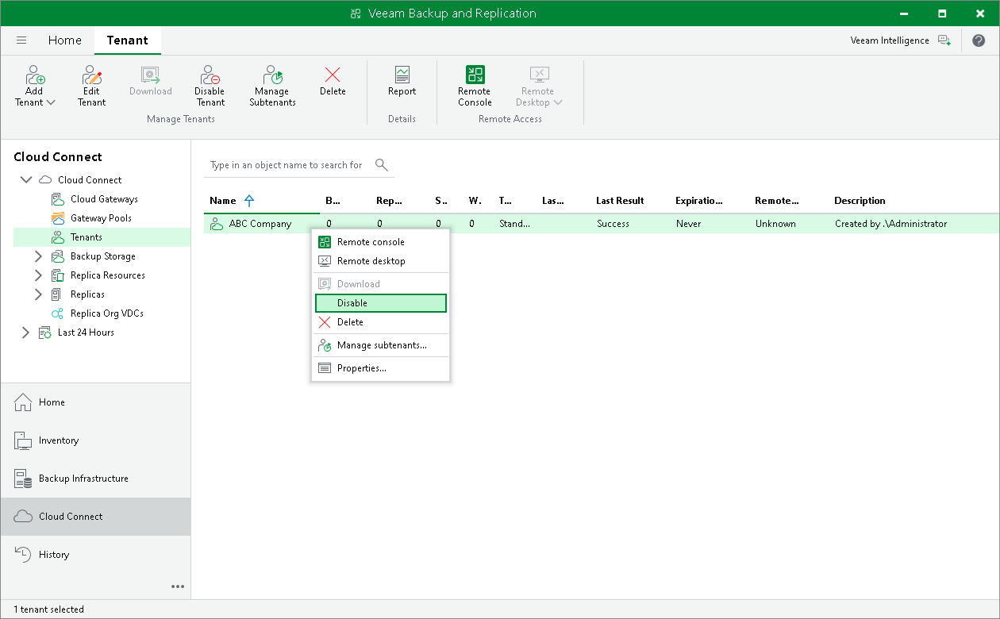

In this article

The SP can temporarily disable a tenant account, for example, if the tenant has not made a payment and must not use cloud repository and cloud host resources for some time.

When the SP disables a tenant account, the tenant can no longer perform the following operations:

* Run backup and backup copy jobs targeted at the cloud backup repository.
* Run replication jobs targeted at the cloud host.
* Restore data from backups on the cloud repository or copy backup files from the cloud repository.
* Perform failover and failback tasks with VM replicas on the cloud host.

All current sessions for the tenant are terminated; all tenant VMs become inactive and the equal number of VMs in the SP license is revoked for other tenants.

To disable a tenant account:

1. Open the Cloud Connect view.
2. In the inventory pane, click the Tenants node.
3. In the working area, select the tenant account that you want to disable and click Disable Tenant on the ribbon. You can also right-click the account in the working area and select Disable.

To enable a disabled account:

1. Open the Cloud Connect view.
2. In the inventory pane, click the Tenant node.
3. In the working area, select the tenant account that you want to enable and click Disable Tenant on the ribbon once again. You can also right-click the account in the working area and select Disable.

Page updated 9/17/2025

Page content applies to build 13.0.1.1071
