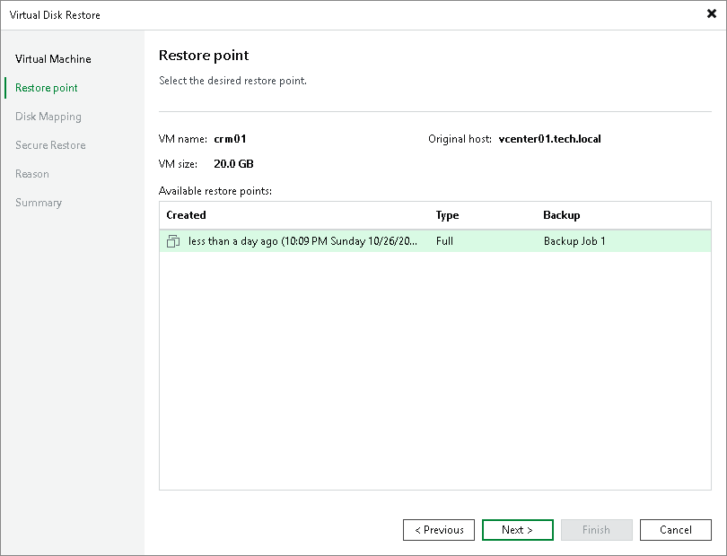
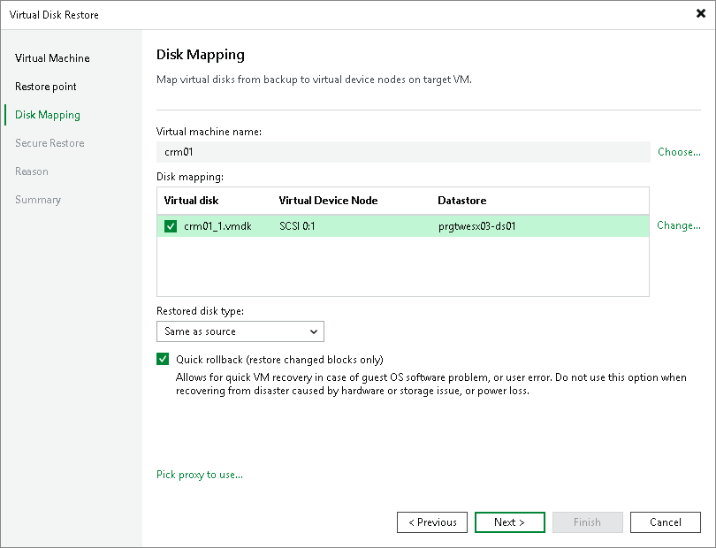
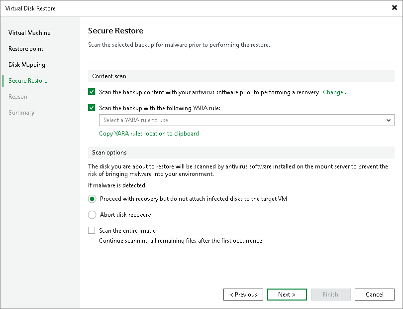

In this article

You can restore virtual hard disks of VMware VMs from the backup. The restored disks can be attached to the original VM (for example, if you need to replace a corrupted disk) or mapped to any other VM.

|  |
| --- |
| Note |
| This section describes only basic steps that you must take to restore virtual disks of a VM. To get a detailed description of all settings of the restore process, see the [Restoring Virtual Disks](https://helpcenter.veeam.com/docs/vbr/userguide/performing_disk_restore.html?ver=13) section in the Veeam Backup & Replication User Guide. |

To restore virtual hard disks:

1. Open the Home view.
2. Select the Backups node in the inventory pane. Expand the backup job in the working area, right-click the necessary VM in the backup job and select Restore virtual disks.
3. At the Restore Point step of the wizard, select the necessary restore point.

1. At the Disk Mapping step of the wizard, click Browse and select the VM to which the restored hard disks must be attached.
2. Select check boxes next to the virtual hard disks that you want to restore.
3. To change the disk format, select the required option from the Restore disks list: same as on the original VM, force thin or force thick.
4. Select the VM disk in the list and click Change. In the Virtual Disk Properties section, select a datastore where the restored hard disk must be located and select a virtual device node.

* If you want to replace an existing virtual disk, select an occupied virtual node.
* If you want to attach the restored disk to the VM as a new drive, select a node that is not yet occupied.

1. [For hard disk restore to the original location and with original format] Select the Quick rollback check box if you want to use incremental restore for the VM disk. Veeam Backup & Replication will query CBT to get data blocks that are necessary to revert the VM disk to an earlier point in time, and will restore only these data blocks from the backup. Incremental restore significantly reduces the restore time and has little impact on the production environment.

1. If you want to scan VM disk data with antivirus software before restoring VM disks to the production environment, at the Secure Restore step of the wizard, specify secure restore settings.

You can instruct Veeam Backup & Replication to scan machine data with YARA rules before restoring the machine to the production environment.

For details on secure restore settings for this operation, see the [Specify Secure Restore Settings](https://helpcenter.veeam.com/docs/vbr/userguide/disk_restore_av_vm.html?ver=13) section in the Veeam Backup & Replication User Guide.

1. At the Reason step of the wizard, specify the reason for future reference.
2. At the Summary step of the wizard, select the Power on target VM after restoring check box if necessary.
3. Click Finish.

Page updated 11/11/2025

Page content applies to build 13.0.1.1071
