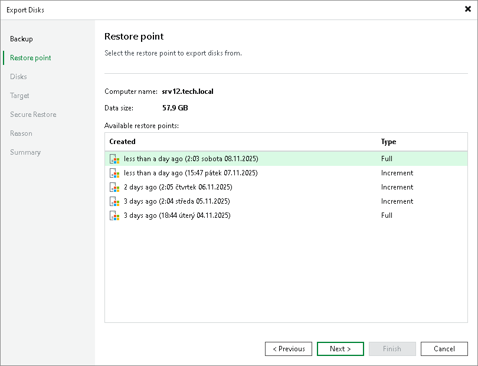
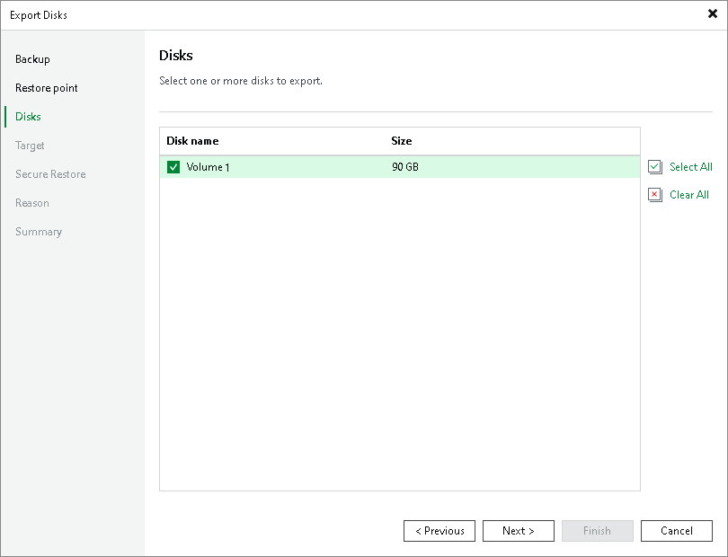
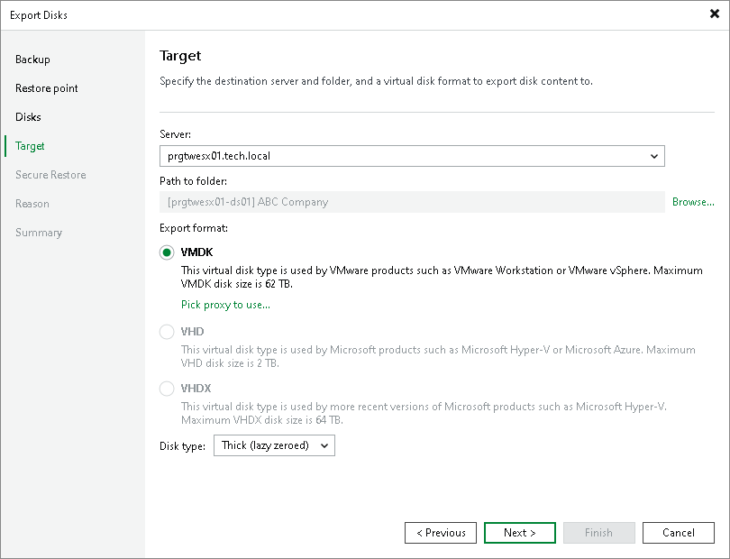

# Exporting Disks from Veeam Agent Backups

You can export computer disks included in volume-level Veeam Agent backups as virtual disks. The resulting virtual disks can be attached to a virtual machine. Thus, you can recover subtenant data that was originally stored on a physical device to the virtual environment.

|  |
| --- |
| Note |
| This section describes only basic steps that you must take to export disks contained in a Veeam Agent backup. To get a detailed description of all settings of the export process, see the [Exporting Disks](https://helpcenter.veeam.com/archive/agentforwindows/13/userguide/integration_disk_restore.html) section in the Veeam Agent for Microsoft Windows User Guide. |

To export disks included in a Veeam Agent backup:

1. Open the Home view.
2. Select the Backups node in the inventory pane. Expand the Agents node in the working area, right-click the necessary Veeam Agent backup and select Export content as virtual disks.
3. At the Restore Point step of the wizard, select the necessary restore point.

1. At the Disks step of the wizard, select check boxes next to the disks that you want to export.

1. At the Target step of the wizard, select the destination for disk export and format in which you want to save the resulting virtual disk:

1. From the Server list, select a server on which the resulting virtual disks must be saved. If you plan to save the disks in the VMDK format on a datastore, select an ESXi host to which this datastore is connected.
2. In the Path to folder field, specify a folder on the server or datastore where the virtual disks must be placed.
3. Select the export format for disks:

* VMDK — select this option if you want to save the resulting virtual disk in the VMware VMDK format.

* VHD — select this option if you want to save the resulting virtual disk in the Microsoft Hyper-V VHD format.
* VHDX — select this option if you want to save the resulting virtual disk in the Microsoft Hyper-V VHDX format (supported by Microsoft Windows Server 2012 and later).

1. [For export of a VMDK disk to an ESXi host] Click the Pick proxy to use link to select backup proxies over which backup data must be transported to the target datastore.
2. [For export of a VMDK disk to an ESXi host] From the Disk Type drop-down list, select how the resulting disk must be saved: in the thin provisioned or thick provisioned format.

1. If you want to scan restored disk data with antivirus software before exporting disks, at the Secure Restore step of the wizard, specify secure restore settings.

1. At the Reason step of the wizard, specify the reason for future reference.

1. At the Summary step of the wizard, click Finish.

