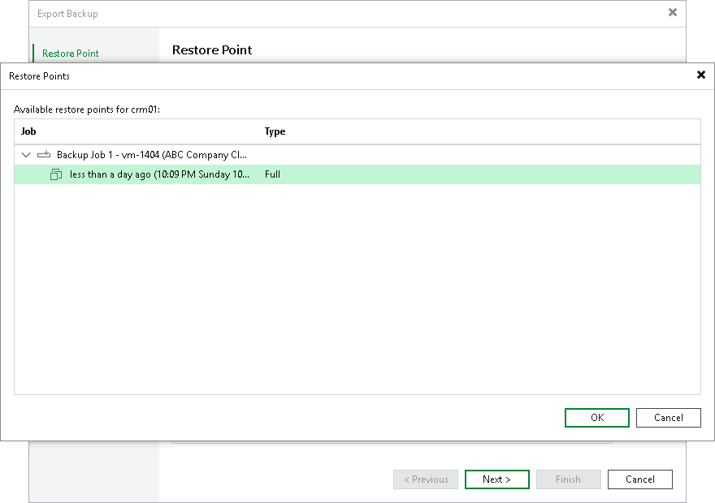

# Exporting Backups

You can export data related to a specific restore point in the backup and save it to a standalone full backup (VBK) file. A standalone full backup is not associated with the existing backup chain and subsequent incremental backups. You can use a standalone full backup as an independent restore point for data recovery.

You can export data to a standalone full backup from VM backups and Veeam Agent backups created in a cloud repository. When you export a backup that resides in a cloud repository, the resulting VBK file is saved to the same cloud repository. The backup is saved in a separate subfolder of the folder that contains tenant backups.

After you export a restore point to a full backup, the resulting full backup becomes available in the tenant Veeam backup console. The tenant can perform the same operations with the standalone full backup as with a regular backup created in a cloud repository.

|  |
| --- |
| Note |
| This section describes only basic steps that you must take to export a restore point to a full backup file. To get a detailed description of all settings of the export process, see the [Exporting Backups](https://helpcenter.veeam.com/docs/vbr/userguide/exporting_backups.html?ver=13) section in the Veeam Backup & Replication User Guide. |

To export a restore point to a full backup file:

1. Open the Home view.
2. Select the Backups node in the inventory pane. Expand the backup job in the working area, right-click the necessary VM or Veeam Agent computer in the backup job and select Export backup.
3. At the Restore Point step of the wizard, click Point and select the necessary restore point.

1. If you want to specify the retention policy for the exported backup, select the Delete exported backup file automatically check box and select the desired time period from the drop-down list. After the specified time period expires, Veeam Backup & Replication will automatically delete the exported backup from the cloud repository.
2. At the Reason step of the wizard, specify the reason for future reference.
3. At the Summary step of the wizard, click Finish.

