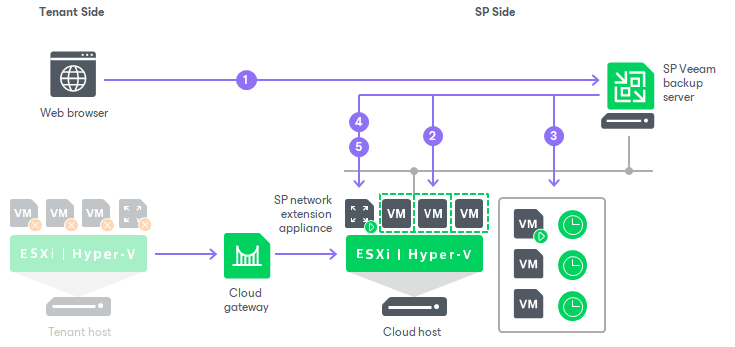

In this article

If the whole tenant production site becomes unavailable because of a software or hardware malfunction, the tenant can perform full site failover. In the full site failover scenario, all critical VMs fail over to their replicas on the cloud host one by one, as a group.

Full site failover is in many regards similar to regular failover by a failover plan. To perform full site failover, Veeam Backup & Replication uses a cloud failover plan that lets Veeam Backup & Replication automatically start VM replicas on the cloud host in the specified order with the specified time delay. To learn more, see [Cloud Failover Plan](cloud_failover_plan_overview.md).

Full site failover is performed in the similar way as regular failover with a failover plan. The main difference is that the full site failover process contains additional steps regarding the use of the provider-side network extension appliance.

Full site failover is performed in the following way:

1. The tenant asks the SP to start full site failover using the SP Veeam Backup & Replication console.
2. For each VM in the cloud failover plan, Veeam Backup & Replication detects its replica. If some VMs in the cloud failover plan have replicas that are already in the Failover or Failback state, Veeam Backup & Replication suggests that they are processed with the cloud failover plan.
3. The replica VMs are started in the order they appear in the cloud failover plan within the set time intervals.
4. Veeam Backup & Replication starts the network extension appliance on the SP side.
5. Veeam Backup & Replication configures the network extension appliance so that it acts as a gateway between the VM replica network and external networks allowing VM replicas to communicate to the internet.

|  |
| --- |
| Note |
| The full site failover process differs for the scenario where tenant VM replicas are created in VMware Cloud Director. To learn more, see [Full Site Failover for VMware Cloud Director Replicas](cloud_vcloud_director_full_failover.md). |

Related Topics

* [Cloud Failover Plan](cloud_failover_plan_overview.md)
* [Full Site Failover for VMware Cloud Director Replicas](cloud_vcloud_director_full_failover.md)

Related Tasks

[Performing Full Site Failover](performing_full_site_failover.md)

Page updated 11/8/2025

Page content applies to build 13.0.1.1071
