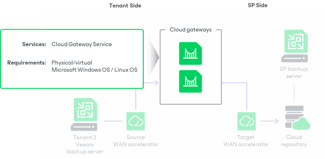

In this article

The Veeam Cloud Connect infrastructure configured at the SP side is hidden from tenants. Tenants know only about cloud repositories and cloud hosts and can work with them as with locally deployed backup repositories and target hosts. Veeam backup servers on the tenant side do not communicate with cloud repositories and cloud hosts directly. Data communication and transfer in the cloud is carried out through cloud gateways.

The cloud gateway is a network appliance that resides on the SP side. The cloud gateway acts as a communication point in the cloud: it routes commands and traffic between the tenant Veeam backup server, SP Veeam backup server and other Veeam Cloud Connect infrastructure components.

The cloud gateway is a Microsoft Windows server or a Linux server running the Cloud Gateway Service — a Microsoft Windows service responsible for establishing a connection between parties in the Veeam Cloud Connect infrastructure.

To deploy a cloud gateway, the SP must assign the cloud gateway role to a necessary server in the SP backup infrastructure. The SP can configure a dedicated cloud gateway or install this role on the SP Veeam backup server. If traffic between the SP and tenants is significant, it is recommended that the SP deploys a dedicated cloud gateway to reduce the workload on the SP Veeam backup server.

The server performing the role of a cloud gateway must meet the following requirements:

* The cloud gateway can be a physical or virtual machine.
* The cloud gateway must run Microsoft Windows OS or a Linux OS.

Cloud Gateway Deployment Scenarios

Depending on the size of the Veeam Cloud Connect infrastructure, the SP can deploy one or several cloud gateways. Veeam Backup & Replication supports many-to-one, one-to-many and many-to-many deployment scenarios:

* In the many-to-one deployment scenario, the SP deploys one cloud gateway that works with several tenants. Data flows for different tenants are securely fenced off on the cloud gateway, which eliminates the risk of data interference and interception.
* In the one-to-many and many-to-many scenarios, the SP deploys several cloud gateways that work with one or several tenants. Several cloud gateways can be used for scalability purposes if the amount of traffic going between the SP side and tenants’ side is significant.

Veeam Backup & Replication supports automatic failover between cloud gateways configured in the Veeam Cloud Connect infrastructure. When a tenant connects to the SP using a DNS name or IP address of a cloud gateway, the Veeam backup server on the tenant side obtains a list of all configured cloud gateways. If the primary cloud gateway is unavailable, the Veeam backup server on the tenant side fails over to another cloud gateway from the list.

The SP can use regular cloud gateways or organize cloud gateways into cloud gateway pools to provide dedicated cloud gateways to the tenant. To learn more, see [Cloud Gateway Pool](cloud_gateway_pool.md).

* Regular cloud gateways deployed in the Veeam Cloud Connect infrastructure are intended for use by an unlimited number of tenants. Such cloud gateways are available to tenants to whom the SP does not assign a cloud gateway pool. For a tenant with no cloud gateway pool assigned, communication between the tenant Veeam backup server and the SP Veeam Cloud Connect infrastructure is carried out through cloud gateways that are not added to any cloud gateway pool.
* Cloud gateways operating as a part of a cloud gateway pool are intended for use by specific tenants. Such cloud gateways are available to tenants to whom the SP assigns the cloud gateway pool. For the tenant with the cloud gateway pool assigned, communication between the tenant Veeam backup server and the SP Veeam Cloud Connect infrastructure is carried out through cloud gateways added to this cloud gateway pool.

Related Tasks

[Adding Cloud Gateways](cloud_connect_gateways.md)

Page updated 9/29/2025

Page content applies to build 13.0.1.1071
