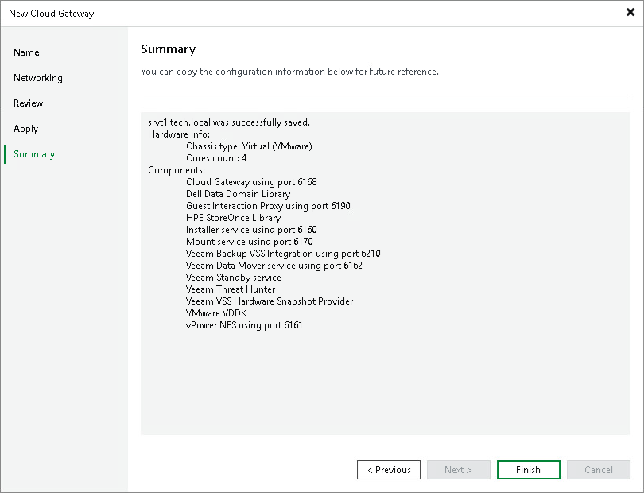

# Step 6. Finish Working with Wizard

At the Summary step of the wizard, complete the procedure of cloud gateway configuration.

1. Review the information about the added cloud gateway.
2. Click Finish to exit the wizard.

