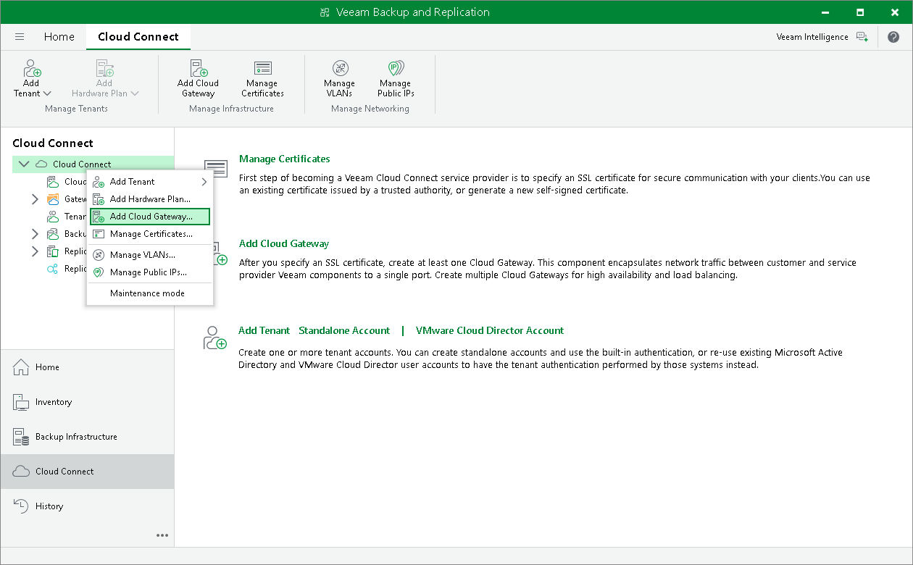

In this article

To launch the New Cloud Gateway wizard, do one of the following:

* Open the Cloud Connect view. Click the Cloud Connect node in the inventory pane and click Add Cloud Gateway in the working area.
* Open the Cloud Connect view. Click Add Cloud Gateway on the ribbon.
* Open the Cloud Connect view. Right-click the Cloud Gateways node in the inventory pane or right-click anywhere in the working area and select Add Cloud Gateway.

Page updated 10/14/2025

Page content applies to build 13.0.1.1071
