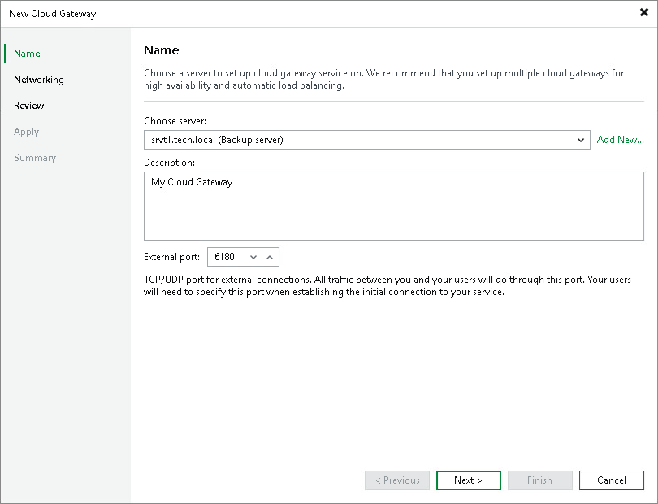

In this article

At the Name step of the wizard, specify settings of a server that will be used as a cloud gateway.

1. From the Choose server list, select a Microsoft Windows server or a Linux server that will perform the role of a cloud gateway. You can select any server added to Veeam Backup & Replication or assign the cloud gateway role to the Veeam backup server itself.

If the server is not added yet, click Add New to open the New Windows Server wizard.

1. In the Description field, provide a description for the cloud gateway. The default description contains information about the user who added the cloud gateway, date and time when the cloud gateway was added.
2. In the External port field, specify a TCP/IP port over which tenant Veeam backup servers will communicate with the cloud gateway. By default, port number 6180 is used.

Page updated 9/29/2025

Page content applies to build 13.0.1.1071
