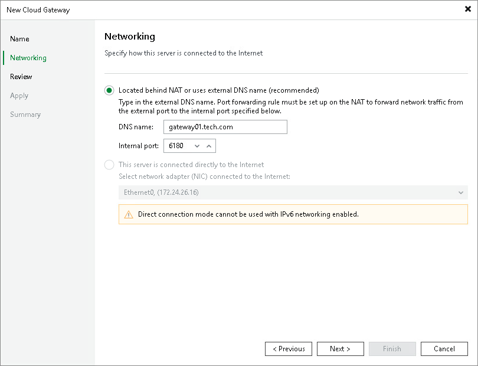

In this article

At the Networking step of the wizard, select the network mode that will be used by the cloud gateway to communicate with Veeam backup servers on the tenant side.

You can choose between two network modes: NAT mode or direct mode.

* If a cloud gateway is located in the local network behind the NAT gateway:

1. Select Located behind NAT or uses external DNS name.
2. In the DNS name field, specify a DNS name of the NAT gateway.

You must specify an individual DNS name for each cloud gateway that you add to the Veeam Cloud Connect infrastructure.

1. In the Internal port field, specify a port on the local network behind the NAT used for listening to connections from tenants. By default, port 6180 is used.
2. On your NAT gateway, configure the port forwarding rule for TCP and UDP protocols: from an incoming port (specified in the External port field at the previous step of the wizard) to the port on the local network used for listening to connections (specified at the Incoming port field at this step of the wizard). For example, if you use default port number values, you must configure the following port forwarding rule: from port 6180 to port 6180.

* If a cloud gateway has a direct network connection to Veeam backup servers on the tenant side, select This server is connected directly to the Internet. From the NIC list, select a network adapter on the cloud gateway server that will be used to communicate with tenants’ Veeam backup servers.

Consider the following:

* If you use a TLS certificate verified by a CA to establish a secure connection between Veeam Cloud Connect infrastructure components, it is recommended that you choose Located behind NAT or uses external DNS name mode for all cloud gateways, including those that have direct network connection to the internet. To learn more, see [Network Settings with Verified TLS Certificates](#recommendations).
* Each cloud gateway must have its own public IPv4 address, regardless of whether the IP address is directly configured on the cloud gateway itself (direct mode) or on a NAT gateway in front of it (NAT mode). To resolve public DNS names of cloud gateways to IP addresses, the SP must create on the DNS server a separate A record for each IP address. For example:

|  |
| --- |
| gateway01.tech.com "A" record to 198.51.100.1 |

Configurations with one DNS record for multiple IP addresses are not supported.

|  |
| --- |
| Note |
| In a scenario where the tenant connects to the SP over a private network, the DNS name of a cloud gateway available to the tenant can resolve to a private IP address. In this scenario, it is recommended that the cloud gateway operates as part of a cloud gateway pool. Otherwise, information about this cloud gateway will be passed to other tenants, including those who connect to the SP from the internet and may have no access to the cloud gateway. |

* The SP can use one public DNS name for their Veeam Cloud Connect infrastructure and provide the tenant with this DNS name instead of DNS names of cloud gateways. In this case, the SP must create DNS records for both public Veeam Cloud Connect DNS name and DNS names of cloud gateways. For example:

|  |
| --- |
| provider.tech.com "A" record to 198.51.100.1 |

|  |
| --- |
| Note |
| For the scenario where the SP assigns [cloud gateway pools](cloud_gateway_pool.md) to tenants and provides the tenant with a public Veeam Cloud Connect DNS name [to connect to the SP](cloud_connect_sp_settings.md), make sure that the public DNS name does not resolve to IP addresses of cloud gateways included in cloud gateway pools that are not available to the tenant. |

* Public DNS names (recommended) or IP addresses of all cloud gateways must be accessible to all tenants and subtenants who work with the SP. Some of the cloud gateways may be temporarily unavailable, for example, due to a failure or for maintenance purposes. However, it is not recommended that one or more IP addresses of a cloud gateway are permanently available only to the limited number of tenants. Such configuration may impact performance of jobs created by tenants and subtenants.
* You cannot use the direct mode if IPv6 communication is enabled in the Veeam Backup & Replication settings. To learn more about support for IPv6 communication, see [IPv6 Support](cloud_connect_ipv6.md).

Network Settings with Verified TLS Certificates

If you use a verified TLS certificate in your Veeam Cloud Connect infrastructure, it is recommended that you configure a cloud gateway in the following way:

1. DNS names of all cloud gateways in Veeam Cloud Connect infrastructure must be associated with the verified TLS certificate.
2. For all cloud gateways, specify the following network settings in the New Cloud Gateway wizard:

1. Select Located behind NAT or uses external DNS name.
2. In the DNS name field, specify an external DNS name of the cloud gateway (in case of direct connection) or a DNS name of the NAT gateway (if a cloud gateway is located behind the NAT gateway).
3. In the Internal port field, specify a port used for listening to connections from tenants:

* If a cloud gateway has a direct connection to the internet, specify the same port that was specified in the External port field at the previous step of the wizard. By default, port 6180 is used.
* If a cloud gateway is located in the local network behind the NAT gateway, specify the same port that is specified in the [port forwarding rule](#rule) on your NAT gateway.

Page updated 2/13/2024

Page content applies to build 13.0.1.1071
