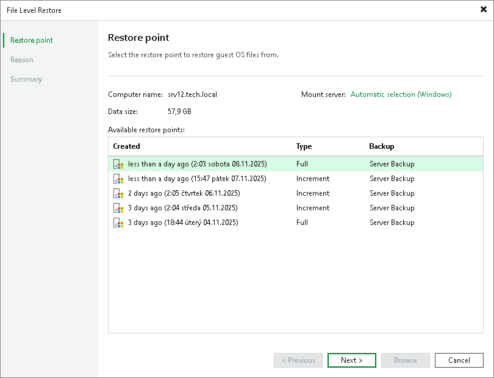
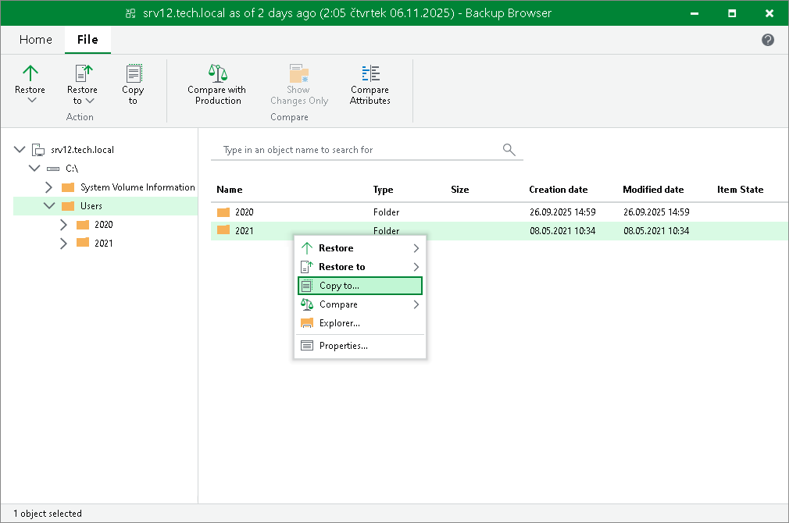

# Restoring Guest OS Files from Veeam Agent Backups

You can restore individual Microsoft Windows guest OS files from backups of machines created with Veeam Agent for Microsoft Windows.

File-level restore from Veeam Agent backups is performed in the same way as for VM backups. Veeam Backup & Replication publishes computer disks from the backup directly into the Veeam backup server file system. After disks are mounted, you can use the Veeam Backup Browser or Microsoft Windows Explorer to copy necessary files and folders to the local machine drive, save them in a network shared folder or point any application to restored files and work with them as usual.

|  |
| --- |
| Note |
| This section describes only basic steps that you must take to restore guest OS files from a Veeam Agent backup. To get a detailed description of all settings of the restore process, see the [Recovering Guest OS Files Using Console](https://helpcenter.veeam.com/docs/vbr/userguide/performing_guest_restore.html?ver=13) section in the Veeam Backup & Replication User Guide. |

To restore Microsoft Windows guest OS files from a Veeam Agent backup:

1. Open the Home view.
2. Click the Backups > Cloud node in the inventory pane and do either of the following:

* If you want to restore files from a backup created with a standalone version of Veeam Agent, expand the Agents node in the working area, right-click the necessary backup and select Restore guest files > Microsoft Windows.
* If you want to restore files from a backup created with Veeam Agent managed by Veeam Backup & Replication, expand the Veeam Agent backup job in the working area, right-click the necessary machine in the job and select Restore guest files > Microsoft Windows.

1. At the Restore Point step of the wizard, select the necessary restore point.

1. At the Reason step of the wizard, specify the reason for future reference.
2. Click Next and then click Browse to finish working with the File Level Restore wizard. Veeam Backup & Replication will mount Veeam Agent machine disks from the backup to the backup server file system and display the Veeam Backup Browser.
3. In the Veeam Backup Browser, Veeam Backup & Replication will display the file system tree of the backed-up machine. Right-click the necessary file or folder and select one of the following options:

* To restore a file or folder to its original location on the Veeam Agent machine:

* Select Restore > Overwrite if you want to overwrite the original file or folder on the backed-up machine file system with the file or folder restored from the backup.
* Select Restore > Keep if you want to save a file or folder restored from the backup next to the original file or folder. Veeam Backup & Replication will add the \_RESTORED\_YYYYMMDD\_HHMMSS postfix to the original file or folder name and save the restored file or folder in the same location where the original file or folder resides.

* To restore to the original location only those files or folders that have changed on the original VM since the restore point for the backup was created, select Compare > Compare. Then right-click the file or folder and select one of the following options:

* Select Restore changed only > Overwrite if you want to overwrite the original file or folder on the backed-up machine file system with the file or folder restored from the backup.
* Select Restore changed only > Keep if you want to save a file or folder restored from the backup next to the original file or folder. Veeam Backup & Replication will add the \_RESTORED\_YYYYMMDD\_HHMMSS postfix to the original file or folder name and save the restored file or folder in the same location where the original file or folder resides.

* To save a file or folder on the local machine or in a network shared folder, select Copy to, specify a path to the destination location and click OK.

To learn more, see the [Finalize Recovery](https://helpcenter.veeam.com/docs/vbr/userguide/guest_restore_save.html?ver=13) section in the Veeam Backup & Replication User Guide.

1. [For restore to the original location] If you restore a file or folder from a backup created with a standalone version of Veeam Agent, Veeam Backup & Replication will prompt you to specify an account to connect to the Veeam Agent machine. In the Credentials window, select a user account that has administrative permissions on the target machine. If you have not set up credentials beforehand, click the Manage accounts link or click Add on the right to add credentials. For more information, see the [Credentials Manager](https://helpcenter.veeam.com/docs/vbr/userguide/credentials_manager.html?ver=13) section in the Veeam Backup & Replication User Guide.

If you restore a file or folder from a backup created with Veeam Agent managed by Veeam Backup & Replication, Veeam Backup & Replication will connect to the Veeam Agent machine using credentials of the account specified for the machine in the protection group settings.

1. Click OK to restore selected files and folders.

