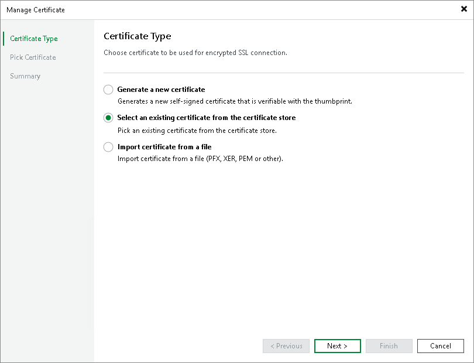
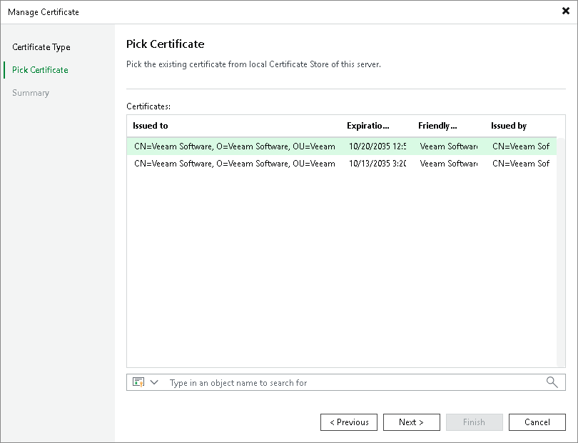

In this article

If your organization has a TLS certificate signed by a CA and the TLS certificate is located in the Microsoft Windows Certificate store, you can use this certificate for authenticating parties in the Veeam Cloud Connect infrastructure.

|  |
| --- |
| Important |
| The account under which the Veeam Cloud Connect Service runs (by default, the Local System account) must have access to the certificate private key. In the opposite case, the certificate will not be installed. |

To select a certificate from the Microsoft Windows Certificate store:

1. Open the Cloud Connect view.
2. Click the Cloud Connect node in the inventory pane and click Manage Certificates in the working area. You can also right-click the Cloud Connect node in the inventory pane and select Manage certificates.
3. At the Certificate Type step of the wizard, choose Select an existing certificate from the certificate store.

1. At the Pick Certificate step of the wizard, select a TLS certificate that you want to use. The certificate must be installed in the Local Computer\Personal certificate store. You can select only certificates that contain both a public key and a private key. Certificates without private keys are not displayed in the list.

1. At the Summary step of the wizard, review the certificate properties.
2. Click Finish to apply the certificate.

Page updated 4/17/2024

Page content applies to build 13.0.1.1071
