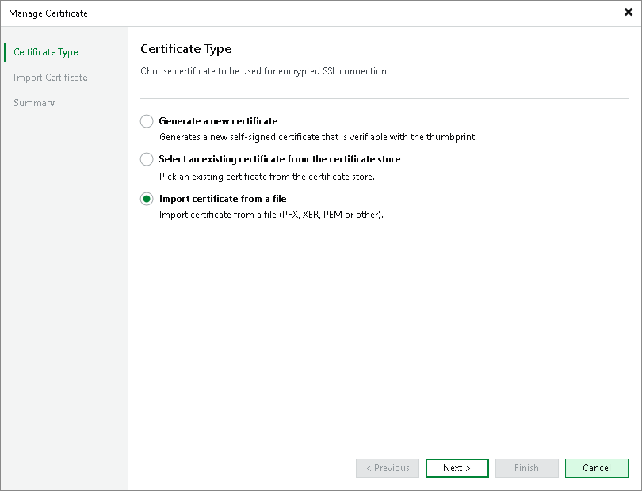
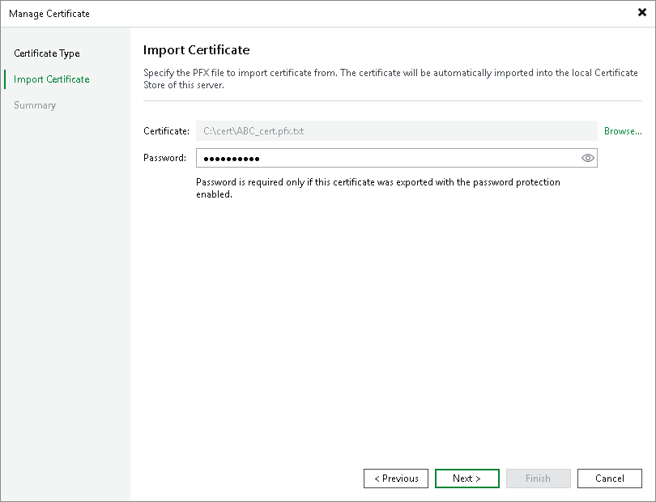

# Importing Certificates from Files

You can import a TLS certificate in the following situations:

* Your organization uses a TLS certificate signed by a CA and you have a copy of this certificate in a file of PFX format.
* You have generated a self-signed TLS certificate in the PFX format with a third-party tool and you want to import it to Veeam Backup & Replication.

|  |
| --- |
| Important |
| Consider the following:   * All certification authorities (CAs) related to the TLS certificate must be trusted by the SP Veeam backup server. Therefore, make sure that they are included in the Intermediate Certification Authorities and Trusted Root Certification Authorities folders within the Microsoft Windows Certificate store. Otherwise, you will not be able to import the TLS certificate. For more information about certificate and connectivity issues, see [this Veeam KB article](https://www.veeam.com/kb2323). * If a PFX file contains a certificate chain, only the end entity certificate will be imported. |

To import a TLS certificate from a PFX file:

1. Open the Cloud Connect view.
2. Click the Cloud Connect node in the inventory pane and click Manage Certificates in the working area. You can also right-click the Cloud Connect node in the inventory pane and select Manage certificates.
3. At the Certificate Type step of the wizard, choose Import certificate from a file.

1. At the Import Certificate step of the wizard, specify a path to the PFX file.
2. If the PFX file is protected with a password, specify the password in the Password field.

1. At the Summary step of the wizard, review the certificate properties. Use the Copy to clipboard link to copy and save information about the TLS certificate. You can send the copied information to your tenants so that they can verify the TLS certificate with the certificate thumbprint.
2. Click Finish to apply the certificate.

