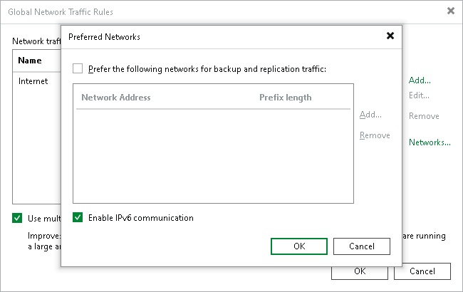

In this article

Veeam Backup & Replication supports IPv6 communication for Veeam Cloud Connect infrastructure components. This functionality is enabled by default in new installations of Veeam Backup & Replication 12. If the SP has upgraded Veeam Backup & Replication from an earlier version of the product, they can enable this functionality manually on the SP backup server. For details, see [Enabling IPv6 Communication](#enable_ipv6).

The following rules apply to IPv6 support in Veeam Cloud Connect:

* After the SP enables IPv6 communication, they can add cloud gateways to the Veeam Cloud Connect infrastructure in the NAT mode only and must specify an external DNS name in the cloud gateway settings. For details, see [Specify Network Settings](cloud_connect_gateway_settings.md).

To enable IPv6 communication for previously added cloud gateways, the SP must reconfigure these cloud gateways using the Edit Cloud Gateway wizard.

* The SP and tenant can specify whether to use IPv6 addresses for network extension appliances. The following scenarios for are available:

* Use an IPv4 interface
* Use an IPv6 interface
* Use both IPv4 and IPv6 interfaces

The SP and tenant can choose whether to assign an IPv4 or IPv6 address automatically, or specify it manually.

The SP configures the SP network extension appliance when subscribing a standalone tenant account to a hardware plan or when configuring a VMware Cloud Director tenant account. For details, see [Creating Tenant Accounts](cloud_connect_tenant.md).

The tenant configures the network extension appliance when adding the SP in the tenant Veeam backup console. For details, see [Connecting to Service Providers](cloud_connect_sp.md).

To enable IPv6 communication for previously deployed network extension appliances, the SP and tenant must redeploy network extension appliances on their sides.

|  |
| --- |
| Note |
| Only the /64 network mask is supported for failover with network extension appliances over the IPv6 protocol. |

* The SP can add IPv6 addresses to the pool of public IP addresses that will be available to tenant VM replicas, and can allocate them in the properties of the tenant account. For details, see [Managing Public IP Addresses](cloud_connect_user_public_ip.md).
* The tenant can specify IPv6 addresses for [default gateways](cloud_connect_default_gateways.md) whose settings Veeam Backup & Replication uses to enable communication with external networks during full site failover.

* For tenant VMs replicated to a cloud host, Veeam Backup & Replication detects IPv6 settings only if application-aware processing is enabled in the properties of the replication job or CDP policy that processes these VMs. These settings are required to map the tenant production network to the network for VM replicas on the SP side.

* During partial site failover, Veeam Backup & Replication establishes separate VPN tunnels for IPv4 and IPv6 communication between network extension appliances.
* If IPv4/IPv6 dual stack networks are present in VMware Cloud Director, Veeam Backup & Replication displays a warning in the replication job or CDP policy session statistics. In this situation, the SP or tenant must manually import all organization VDC networks to all vApps in which the VM replicas and network extension appliance reside. Otherwise, failover to VMs in VMware Cloud Director may fail.

For details on how to add networks to a vApp, see [VMware Docs](https://docs.vmware.com/en/VMware-Cloud-Director/10.5/VMware-Cloud-Director-Tenant-Guide/GUID-B95FB8AF-C428-4FCB-88DA-5DCA35B19B5A.html).

Keep in mind that after the networks are added to a vApp, Veeam Backup & Replication will continue displaying the warning. The SP can instruct Veeam Backup & Replication to suppress the warning with a registry key. For more information, contact [Veeam Customer Support](https://www.veeam.com/support.html).

Enabling IPv6 Communication

If you have upgraded from an earlier version of Veeam Backup & Replication and want to allow communication over the IPv6 protocol in the Veeam Cloud Connect infrastructure, you must enable this option in the Veeam Backup & Replication settings.

To enable IPv6 communication:

1. In the Veeam backup console on the SP backup server, from the Main Menu, select Network Traffic Rules.
2. In the Global Network Traffic Rules window, click Networks.
3. In the Preferred Networks window, select the Enable IPv6 communication check box.
4. Click OK.

|  |
| --- |
| Note |
| Consider the following:   * After the SP enables IPv6 communication in the Veeam Cloud Connect infrastructure, the SP and tenant must redeploy network extension appliances that were deployed earlier to use IPv6 addresses for these components. * If the SP wants to disable IPv6 communication in the Veeam Cloud Connect infrastructure, they must disable IPv6 interfaces in the properties of network extension appliances before performing this operation. Otherwise, Veeam Backup & Replication will display a message with the list of network extension appliances that must be reconfigured. |

Page updated 6/19/2024

Page content applies to build 13.0.1.1071
