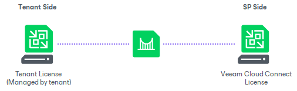
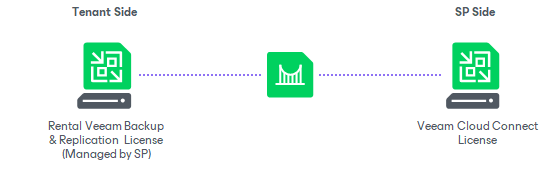

In this article

Veeam Cloud & Service Providers (VCSPs) use rental licenses in the Veeam Backup & Replication infrastructure. Veeam Software provides VCSPs with the following types of rental license:

* [Veeam Cloud Connect license](cloud_connect_sp_license.md). Technically, the Veeam Cloud Connect license is the rental license with the Cloud Connect Provider = Yes field in the license key file. The SP uses this type of license on the SP backup server. The SP must not install this license on tenant backup servers. To learn more, see [Offsite Backup and Disaster Recovery (BaaS and DRaaS)](#vcc).
* [Rental Veeam Backup & Replication license](cloud_connect_hosting_licenses.md). The rental Veeam Backup & Replication license contains the Cloud Connect Provider = No field in the license key file. The SP uses this type of license on tenant backup servers in the Managed Service scenario. To learn more, see [Managed Service](#baas).

Offsite Backup and Disaster Recovery (BaaS and DRaaS)

The Veeam Cloud Connect functionality allows the SP to provide offsite backup and disaster recovery services to tenants. To enable the Veeam Cloud Connect functionality, the SP must install the [Veeam Cloud Connect license](cloud_connect_sp_license.md) on the SP backup server. After that, the SP can configure the Veeam Cloud Connect infrastructure and provide backup and replication resources to tenants.

Veeam Cloud Connect offers the following data protection scenarios:

* Backup as a Service (Veeam Cloud Connect Backup). This scenario is intended for tenants who have Veeam Backup & Replication, Veeam Agent for Microsoft Windows or Veeam Agent for Linux deployed and want to back up and copy machines to the cloud. In this scenario, Veeam products on the tenant side may have any type of paid license installed. To learn more, refer to the product documentation on [Veeam Help Center](https://www.veeam.com/documentation-guides-datasheets.html).
* Disaster Recovery as a Service (Veeam Cloud Connect Replication). This scenario is intended for tenants who have Veeam Backup & Replication deployed and want to replicate VMs to the cloud. In this scenario, Veeam backup servers on the tenant side may have any type of paid license installed in Veeam Backup & Replication. To learn more, see the [Types of Licenses](https://helpcenter.veeam.com/docs/vbr/userguide/types_of_licenses.html?ver=13) section in the Veeam Backup & Replication User Guide.

In these scenarios, tenant machines processed in Veeam Backup & Replication consume both licenses: the Veeam Cloud Connect license and the license installed on the tenant backup server.

Managed Service (MSP Backup)

SPs can provide backup and replication services to tenants who want to protect data of their virtual or physical machines and do not want to manage the Veeam backup infrastructure on their own account. In terms of Veeam products, this scenario is referred to as Managed Service, and the SP providing services within this scenario is referred to as Managed Service Provider (MSP). In this scenario, the SP deploys Veeam Backup & Replication and Veeam Agents on the tenant side, configures and manages backup and replication jobs and charges tenants for processing tenant machines. The SP typically performs these operations on-site or remotely using a web-based UI.

In the Managed Service scenario, in the Veeam products deployed on the tenant side, the SP must install a [Rental Veeam Backup & Replication license](cloud_connect_hosting_licenses.md) for the total number of instances for workloads that the tenant plans to protect. In case the SP provides offsite backup and disaster recovery within this scenario, the Veeam Cloud Connect license on the SP side and the Rental Veeam Backup & Replication license on the tenant side are consumed according to the following rules:

* Tenant machines processed by backup jobs and backup copy jobs targeted at a cloud repository consume the Rental Veeam Backup & Replication license and do not consume the Veeam Cloud Connect license. To learn more, see [Rental Machines Licensing](cloud_connect_rental_lic.md).
* Tenant machines processed by replication jobs targeted at a cloud host consume both the Veeam Cloud Connect license and the Rental Veeam Backup & Replication license.

In This Section

* [Veeam Cloud Connect License](cloud_connect_sp_license.md)
* [Rental Veeam Backup & Replication License](cloud_connect_hosting_licenses.md)
* [Installing License](sp_install_license.md)
* [Updating License](sp_update_license.md)
* [Viewing License Information](sp_view_license.md)
* [Reducing Number of Used Points](sp_reduce_vms.md)
* [Viewing Tenant Machine Count](cloud_connect_machine_count.md)
* [Resetting Tenant Machine Count](cloud_connect_reset.md)
* [License Usage Reporting](sp_license_usage_report.md)

Page updated 11/11/2025

Page content applies to build 13.0.1.1071
