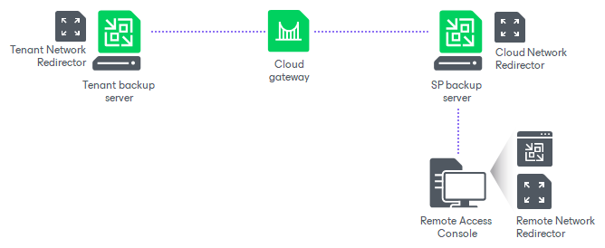

# Network Redirectors

To open and keep a communication channel between the tenant backup server and SP backup infrastructure, Veeam Backup & Replication uses network redirectors. Network redirectors route requests between Veeam Backup & Replication components of the two parties allowing Veeam Backup & Replication to pass commands from the SP side to the tenant side. As a result, the SP can remotely access the tenant backup server and perform data protection and disaster recovery tasks in Veeam Backup & Replication deployed on the tenant side.

Technically, a network redirector is an executable file residing in the Veeam Backup & Replication installation folder. A network redirector is deployed on every Veeam backup server or dedicated machine on which you install the Veeam Backup & Replication console. However, Veeam Backup & Replication uses network redirectors only on those machines that take part in establishing a remote connection to the tenant backup server.

Depending on what Veeam Backup & Replication component is deployed on the machine, a network redirector can perform one of the following roles:

* Cloud network redirector — a network redirector that runs on the SP backup server (a backup server on which the Veeam Cloud Connect license is installed). Cloud network redirector accepts connections from Tenant network redirectors and Remote Access Console and routes requests between these components.
* Tenant network redirector — a network redirector that runs on the tenant backup server. The Veeam Backup Service running on the tenant backup server starts this network redirector when the tenant enables the Allow this Veeam Backup & Replication installation to be managed by the service provider option in the Service Provider wizard. Tenant network redirector opens a control connection to the cloud network redirector and runs in the background enabling remote access to the tenant backup server from the SP side.
* Remote network redirector — a network redirector that runs on the machine where Remote Access Console is installed (the SP backup server of a dedicated machine). Veeam Backup & Replication uses this network redirector only to open a remote desktop session to the tenant backup server. The Remote Access Console starts the Remote network redirector when the SP selects the tenant in the Open Remote Access Console window. After the SP closes the Remote Access Console, Veeam Backup & Replication stops the Remote network redirector, too.

Veeam Backup & Replication components involved in remote connection scenarios communicate differently depending on the type of connection to the tenant backup server — with the Remote Access Console or over the Remote Desktop Protocol. To learn more, see [How Remote Access Console Works](cloud_connect_remote_console_hiw.md) and [How Remote Desktop Connection to Tenant Works](cloud_connect_remote_desktop_hiw.md).

