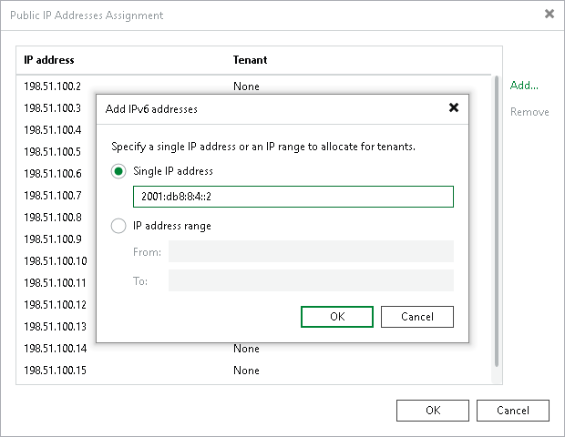
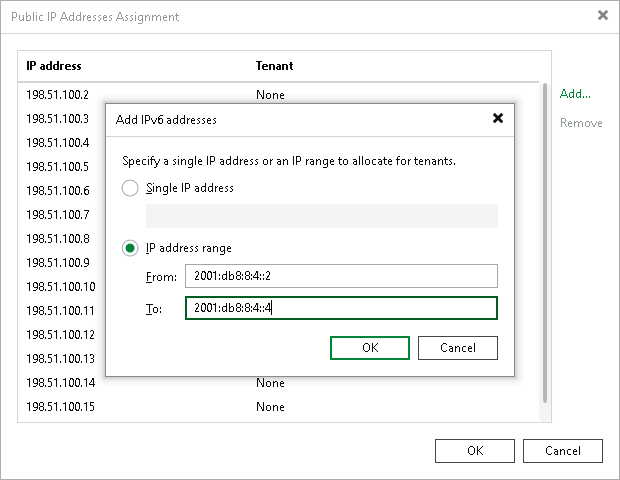

In this article

To configure a pool of public IPv6 addresses:

1. Open the Public IP Addresses Assignment dialog window in one of the following ways:

* Open the Cloud Connect view, click the Cloud Connect node and click Manage Public IPs on the ribbon.
* Open the Cloud Connect view, right-click the Cloud Connect node and select Manage public IP addresses.

1. In the Public IP Addresses Assignment window, click Add and select IPv6 addresses.
2. In the Add IPv6 addresses window, do either of the following:

* If you want to add to the pool of public IP addresses one IP address, make sure that the Single IP address option is selected and specify the necessary IP address.

* If you want to add to the pool of public IP addresses several IP addresses at a time, select the IP address range option and specify the first and the last IP address of the range.

1. Click OK.

Page updated 11/9/2023

Page content applies to build 13.0.1.1071
