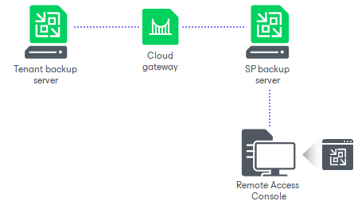
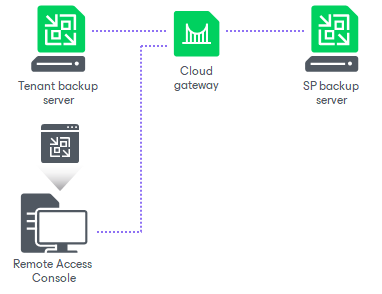

In this article

Veeam Backup & Replication offers the following scenarios of the Remote Access Console usage:

* The SP can use the Remote Access Console installed on the SP backup server or dedicated machine that is connected to the SP backup infrastructure network. In this scenario, the Remote Access Console will connect directly to the SP backup server to communicate to the Veeam Backup Service and Cloud network redirector.

* The SP can use the Remote Access Console on any machine that resides outside of the SP backup infrastructure and has access to the cloud gateway. In this case, the Remote Access Console will connect to the SP backup server over the internet through the cloud gateway.

By default, Veeam Backup & Replication does not accept connections from the Remote Access Console over the internet. The SP can enable this functionality in the Veeam Backup & Replication settings if necessary. To learn more, see [Enabling Access to Cloud Gateway](cc_remote_access.md).

Page updated 1/30/2024

Page content applies to build 13.0.1.1071
