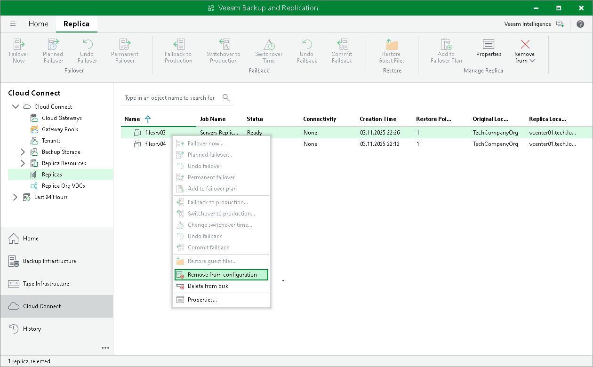

In this article

You can use the Remove from configuration operation if you want to remove records about tenant VM replicas from the Veeam Backup & Replication console and database. Replicated VMs remain on the cloud host and, if necessary, you can start them manually after Remove from configuration operation is performed.

|  |
| --- |
| Important |
| After you perform the Remove from configuration operation, records about tenant VM replicas will be permanently removed from configuration. You will not be able to reinstate them in the Veeam Backup & Replication console and database.  The tenant will not be able to use VM replicas that remain on the cloud host. To let the tenant use such VM replicas, you will have to map VM replicas to a new replication job. To learn more, see [this Veeam KB article](https://www.veeam.com/kb2158). |

To remove records about VM replicas from the Veeam Backup & Replication console and database:

1. Open the Cloud Connect view.
2. In the inventory pane, click Replicas.
3. In the working area, right-click the necessary VM replica and select Remove from configuration.

Page updated 4/17/2024

Page content applies to build 13.0.1.1071
