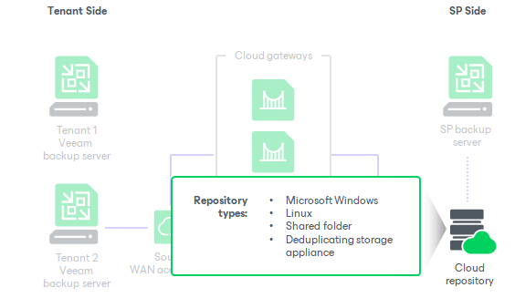

In this article

The cloud repository is a storage location in the cloud where tenants can store their VM data. Tenants can utilize the cloud repository as a target for backup and backup copy jobs and restore data from the cloud repository.

The cloud repository is a regular backup repository configured in the SP backup infrastructure. The SP can use the following types of backup repository as a cloud repository:

* Microsoft Windows-based server
* Linux-based server, including hardened backup repository

To learn more, see [Support for Hardened (Immutable) Backup Repository](#hardened_repository).

* Shared folder
* Deduplicating storage appliance: Dell Data Domain, ExaGrid and Quantum DXi
* Scale-out backup repository

To learn more, see [Support for Scale-Out Backup Repository](#sobr).

* Object storage, including S3 compatible, Amazon S3, IBM Cloud, Microsoft Azure, Wasabi and Veeam Data Cloud Vault

To learn more, see [Backup to Object Storage](cc_object_storage.md).

The SP can expose cloud repository resources to one or several tenants. For each tenant, the SP allocates some storage space on the cloud repository. This storage space is consumed when the tenant runs data protection tasks targeted at the cloud repository.

The amount of space allocated to the tenant on the cloud repository is limited by a storage quota. If tenants must be able to use storage resources on the cloud repository for a limited period of time, the SP can also define a lease period for every tenant.

Being a multi-tenant storage resource, the cloud repository still appears as a logically separate backup repository to every tenant. Data in the cloud repository is segregated and isolated. Every tenant has its own folder on the cloud repository where tenant VM data is stored. Tenants do not know about other tenants who work with the cloud repository, and have no access to their data.

The tenant can have quotas on one or several cloud repositories configured by the SP. Several cloud repositories for one SP do not make up a pool of storage resources; they are used as separate backup infrastructure components. For example, if the tenant configures a backup job, the tenant can target it at only one cloud repository. All restore points created by this backup job will be stored on this cloud repository and will not be spread across several cloud repositories, even if the tenant has storage quotas on several cloud repositories.

Support for Hardened (Immutable) Backup Repository

To protect tenant backup files from loss due to malware activity or unplanned actions, the SP can add a hardened repository based on a Linux server to the backup infrastructure. The hardened repository has an immutability feature that specifies a period of time during which backup files must be immutable. The behavior of the hardened (immutable) backup repository in the Veeam Cloud Connect infrastructure does not differ from the behavior of this component in the regular Veeam backup infrastructure. To learn more, see the [Hardened Repository](https://helpcenter.veeam.com/docs/vbr/userguide/hardened_repository.html?ver=13) section in the Veeam Backup & Replication User Guide.

Keep in mind that the immutable time is a per-repository setting and different tenants cannot have different immutable times.

|  |
| --- |
| Note |
| Hardened (immutable) backup repository is not supported for tenants that run Veeam Backup & Replication versions earlier than version 11.   * If storage quotas are allocated for such tenants on the cloud repository, the SP cannot enable immutability in the backup repository settings. * Backup repositories with enabled immutability are not displayed in the Edit Tenant wizard for such tenants. |

Support for Scale-Out Backup Repository

Along with a simple backup repository, the SP can use a scale-out backup repository as a cloud repository. A scale-out backup repository is a repository system that supports multi-tier data storage and can comprise following tiers of storage:

* Performance Tier. This functionality allows the SP and the tenant to quickly access the backup data. The SP uses this functionality for tenant backups in a similar way to a simple backup repository. Performance tier extents can be simple backup repositories or object storage repositories. To learn more, see the [Performance Tier](https://helpcenter.veeam.com/docs/vbr/userguide/backup_repository_sobr_extents.html?ver=13) section in the Veeam Backup & Replication User Guide.

The SP can migrate tenant data between performance extents within the same scale-out backup repository to balance storage resources. To perform this operation, the SP must use Veeam PowerShell cmdlets. To learn more, see [Migrating Tenant Data Between Performance Tier Extents](cc_sobr_migration.md).

* Capacity Tier. The SP uses this functionality to offload tenant backups for long-term storage. Capacity tier is a cloud-based object storage repository. To learn more, see [Support for Capacity Tier](cloud_connect_capacity_tier.md).
* Archive Tier. The SP uses this functionality to keep backups of rarely accessed tenant data. Archive tier is a cloud-based object storage repository. To learn more, see [Support for Archive Tier](cloud_connect_archive_tier.md).

For more information, see the [Scale-Out Backup Repositories](https://helpcenter.veeam.com/docs/vbr/userguide/backup_repository_sobr.html?ver=13) section in the Veeam Backup & Replication User Guide.

|  |
| --- |
| Note |
| The SP may need to rebalance a scale-out backup repository used as a cloud repository for maintenance purposes. This operation is time consuming and requires careful consideration of its limitations before proceeding. To learn more, see the [Rebalancing Extents of Scale-Out Backup Repositories](https://helpcenter.veeam.com/docs/vbr/userguide/sobr_rebalance.html?ver=13) section in the Veeam Backup & Replication User Guide. |

Related Tasks

[Configuring Cloud Repositories](cloud_connect_configure_repository.md)

Page updated 11/28/2025

Page content applies to build 13.0.1.1071
