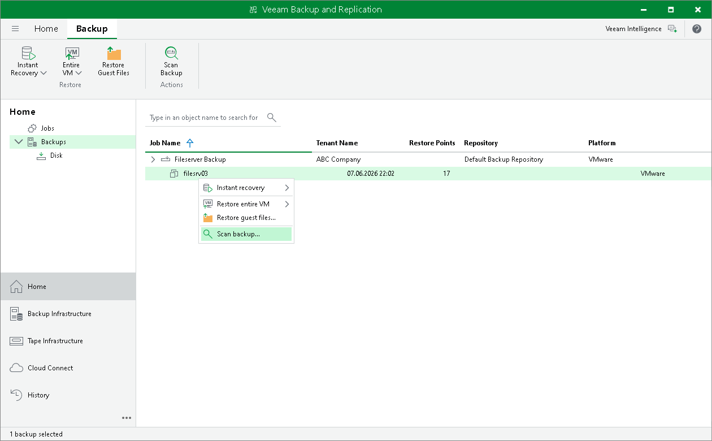

# Scanning Tenant Backups

The scan backup functionality allows the SP to scan tenant backups stored in cloud repositories for malware. The SP can use this functionality to check tenant backups for infected restore points and to identify the last clean restore point that can be used for recovery. As a result, the SP can detect which restore points are infected and which are safe to use for recovery.

The SP scans tenant backups on the SP backup server with an antivirus software, YARA rules, or both. The scan can be performed for backups created by tenant backup jobs and backup copy jobs that target cloud repositories.

For details, see the [Scan Backup](https://helpcenter.veeam.com/docs/vbr/userguide/malware_detection_scan_backup.html?ver=13) section in the Veeam Backup & Replication User Guide.

To scan a tenant backup, do the following:

1. Open the Home view.
2. Select the Backups node in the inventory pane.
3. Expand the backup job in the working area, click Scan Backup on the ribbon or right-click the necessary VM in the backup job and select Scan backup.

To get a detailed description of the scan backup configuration, see the [Configuring Scan Backup Session](https://helpcenter.veeam.com/docs/vbr/userguide/malware_detection_scan_backup_configure.html?ver=13) section in the Veeam Backup & Replication User Guide.

Page updated 2026-06-24

