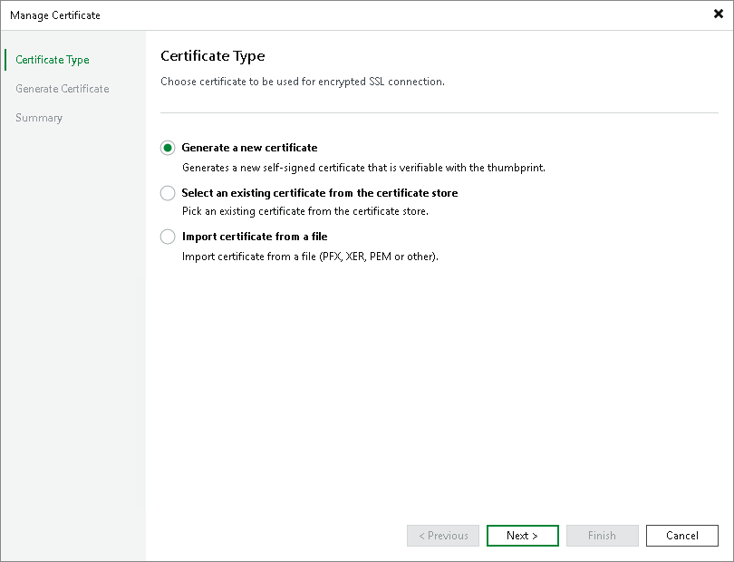
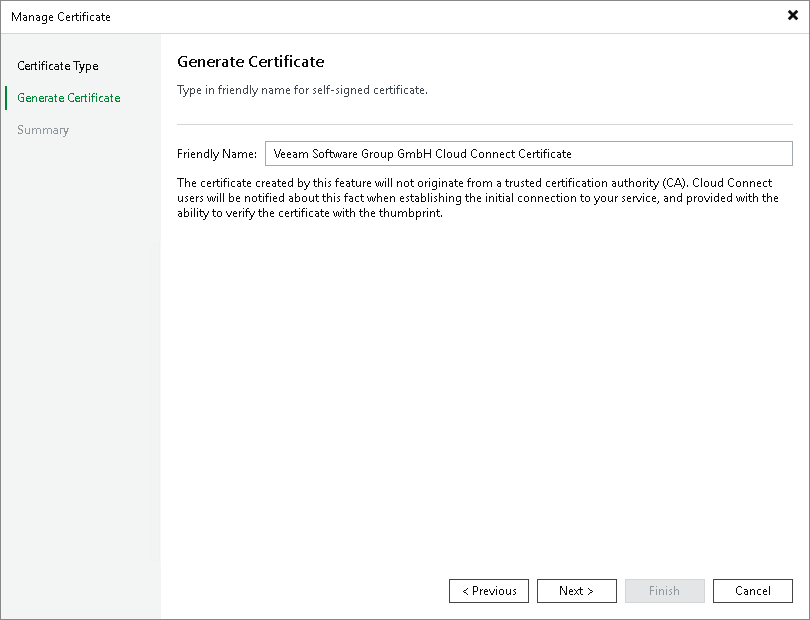
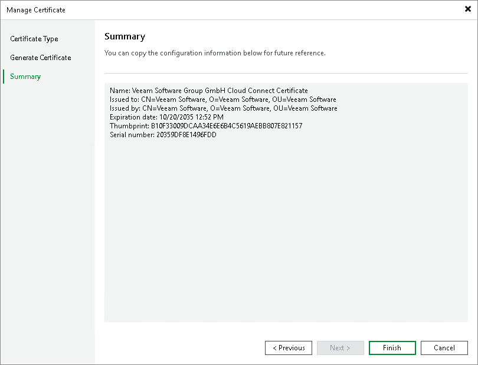

In this article

You can use Veeam Backup & Replication to generate a self-signed certificate for authenticating parties in the Veeam Cloud Connect infrastructure.

To generate TLS certificates, Veeam Backup & Replication employs the RSA Full cryptographic service provider by Microsoft Windows installed on the Veeam backup server. The created TLS certificate is saved to the Shared certificate store. The following types of users can access the generated TLS certificate:

* User who created the TLS certificate
* LocalSystem user account
* Local Administrators group

If you use a self-signed TLS certificate generated by Veeam Backup & Replication, you do not need to take any additional actions to deploy the TLS certificate on the tenants side. When the tenant adds the SP to Veeam Backup & Replication, a matching TLS certificate with a public key is installed on the tenant Veeam backup server automatically. During the procedure of SP adding, Veeam Backup & Replication retrieves the TLS certificate with a public key from the SP Veeam backup server and saves this TLS certificate to the Veeam Backup & Replication database used by tenant Veeam backup server. Veeam Backup & Replication gets the saved TLS certificate from the database when needed.

|  |
| --- |
| Note |
| When you generate a self-signed TLS certificate with Veeam Backup & Replication, you cannot include several aliases to the certificate and specify a custom value in the Subject field. The Subject field value is taken from the Veeam Backup & Replication license installed on the Veeam backup server. |

To generate a self-signed TLS certificate:

1. Open the Cloud Connect view.
2. Click the Cloud Connect node in the inventory pane and click Manage Certificates in the working area. You can also right-click the Cloud Connect node in the inventory pane and select Manage certificates.
3. At the Certificate Type step of the wizard, select Generate a new certificate.

1. At the Generate Certificate step of the wizard, specify a friendly name for the created self-signed TLS certificate.

1. At the Summary step of the wizard, review the certificate properties. Use the Copy to clipboard link to copy and save information about the generated TLS certificate. You can send the copied information to your tenants so that they can verify the TLS certificate with the certificate thumbprint.
2. Click Finish. Veeam Backup & Replication will save the generated certificate in the Shared certificate store on the Veeam backup server.

Page updated 4/17/2024

Page content applies to build 13.0.1.1071
