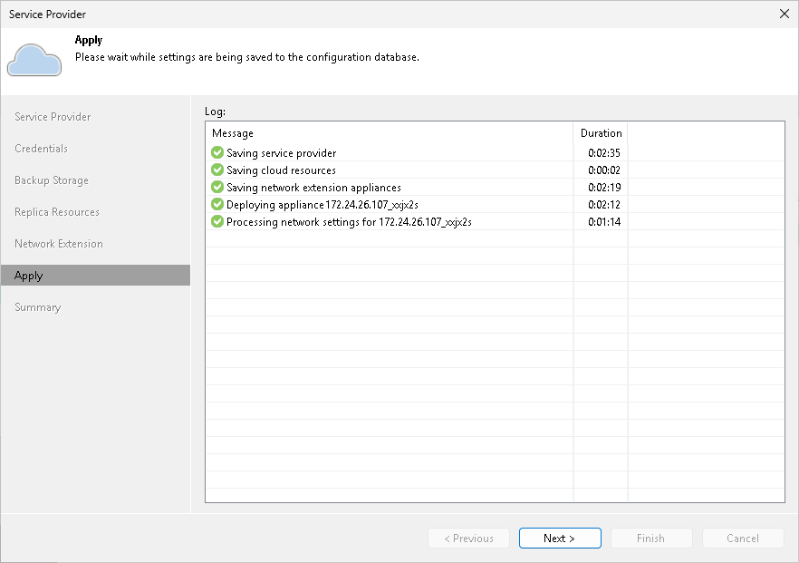

# Step 7. Assess Results

At the Apply step of the wizard, Veeam Backup & Replication will save information about resources available from your SP and deploy the specified number of network extension appliances on your production host. Wait for the required operations to complete and click Next to continue.

Page updated 2026-08-03

