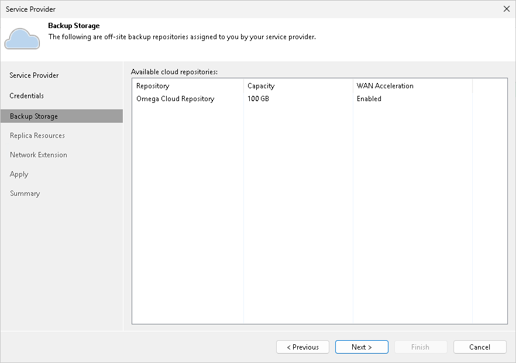

In this article

At the Resources step of the wizard, Veeam Backup & Replication will automatically enumerate resources provided to the tenant on the cloud repository and display the results in the wizard window.

Enumeration of storage resources on the cloud repository may take some time. Wait for the processing to complete and click Next.

Page updated 1/25/2024

Page content applies to build 13.0.1.1071
