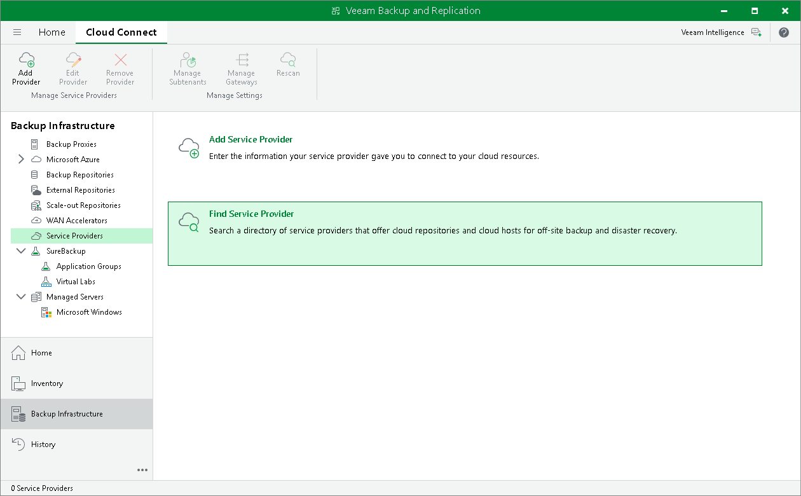

In this article

You can look for SPs who offer Backup as a Service and Disaster Recovery as a Service using Veeam Backup & Replication. The list of SPs is published on the Veeam website and constantly updated. You can select the necessary SP from the list and contact this SP to get the cloud repository service.

|  |
| --- |
| Note |
| This operation is unavailable if you have already added at least one SP in the Veeam backup console. |

To find an SP:

1. Open the Backup Infrastructure view.
2. Select the Service Providers node in the inventory pane.
3. Click Find Service Provider in the working area. A [page of the Veeam website](https://www.veeam.com/find-a-veeam-cloud-provider.html?ad=bkp-prod-v9&id=02067762) will open in your web browser. Use the filter on the webpage to find the necessary SP by the type of provided cloud services, SP datacenter location or virtualization platform.

Page updated 4/17/2024

Page content applies to build 13.0.1.1071
