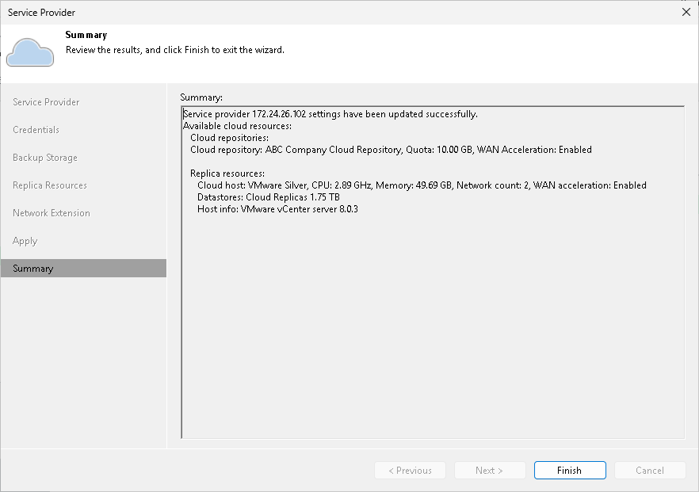

# Step 8. Finish Working with Wizard

At the Summary step of the wizard, complete the procedure of SP adding.

1. Review the configuration information on the added SP.
2. Click Finish to exit the wizard.

