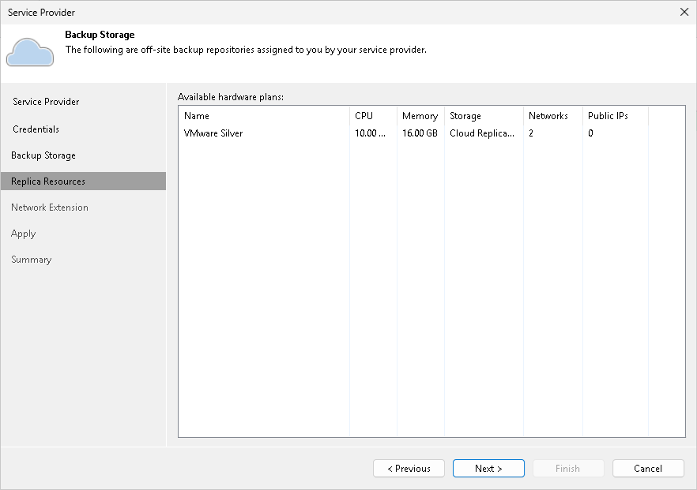
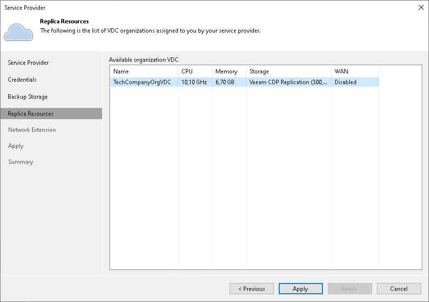

In this article

At the Replica Resources step of the wizard, Veeam Backup & Replication will automatically enumerate computing, storage and network resources provided to the tenant for processing tenant VM replicas. Replication resources can be provided to the tenant in one of the following ways:

* Through hardware plans.

If you add the SP using credentials of a standalone tenant account, available replication resources will be displayed in the Available hardware plans list.

* Through organization VDCs.

If you add the SP using credentials of a VMware Cloud Director tenant account, available replication resources will be displayed in the Available organization VDC list.

Enumeration of replication resources may take some time. Wait for the processing to complete and click Next.

Page updated 11/9/2023

Page content applies to build 13.0.1.1071
