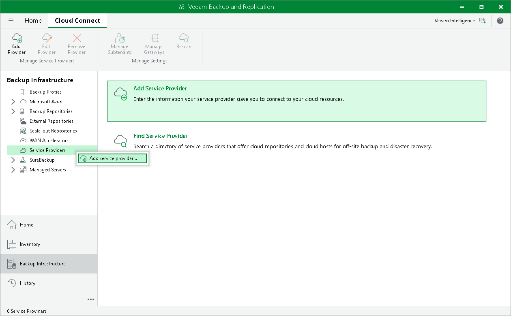

# Step 1. Launch Service Provider Wizard

To launch the Service Provider wizard, do one of the following:

* Open the Backup Infrastructure view. Select the Service Providers node in the inventory pane and click Add Provider on the ribbon.
* Open the Backup Infrastructure view. Right-click the Service Providers node in the inventory pane and select Add service provider.
* Open the Backup Infrastructure view. Select the Service Providers node in the inventory pane and click Add Service Provider in the working area.

