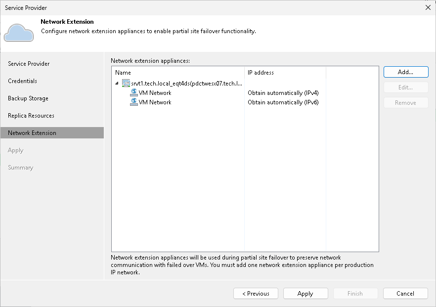
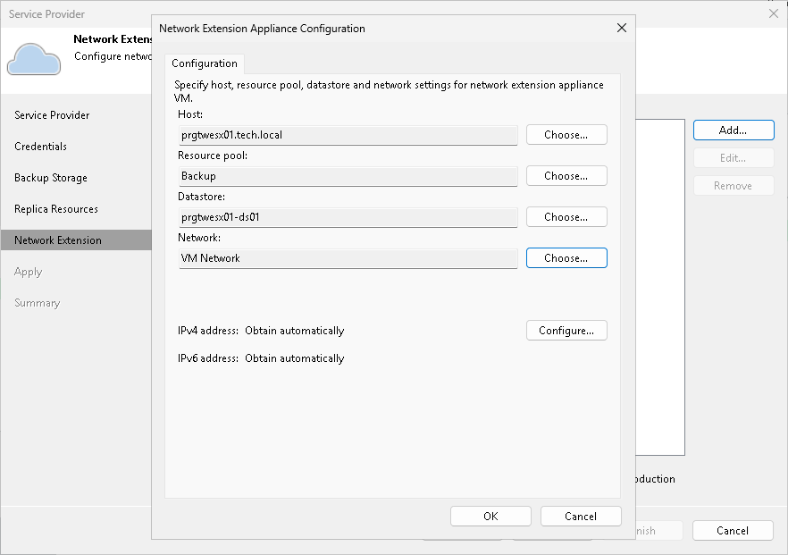
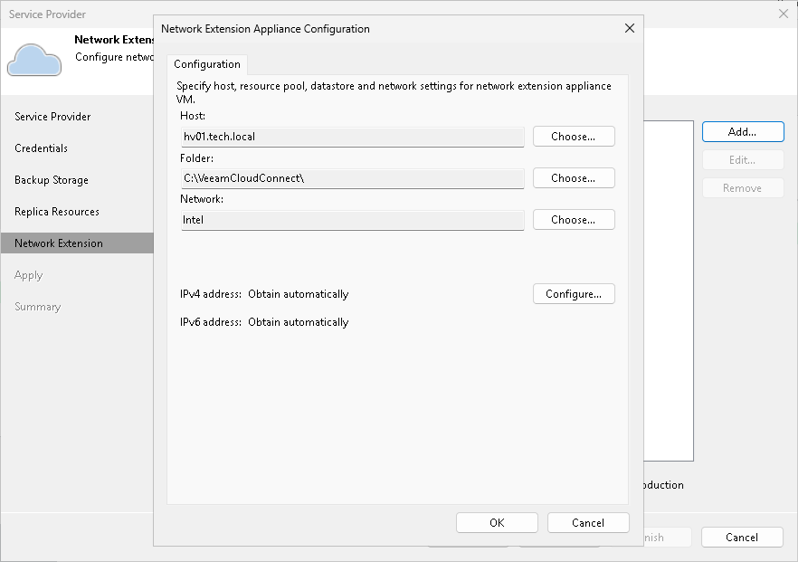
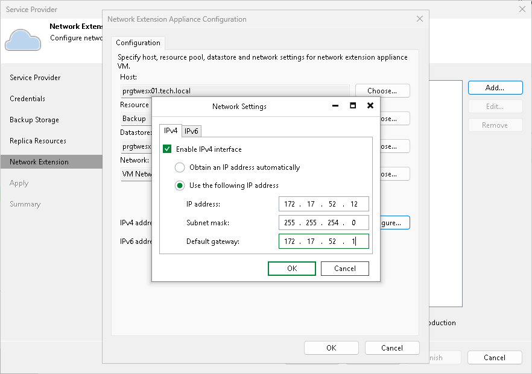

In this article

At the Network Extension step of the wizard, Veeam Backup & Replication will display network extension appliance that will be deployed on the tenant side. This network extension appliance will be used for establishing and maintaining connection between production VMs and VM replicas on the cloud host after partial site failover.

In the Network extension appliances section of the Network Extension step of the wizard, you can view default network extension settings, edit settings for the network extension appliance and add one or several network extension appliances in case there are multiple IP networks in your production environment. To learn more, see [Network Extension Appliance](cloud_network_extension_appliance.md).

|  |
| --- |
| Note |
| Consider the following:   * If you do not plan to perform partial site failover, you can remove the network extension appliance from the Network extension appliances list and proceed to the next step of the wizard. In this case, Veeam Backup & Replication will not deploy the network extension appliance on the source virtualization host. * If you add the SP using credentials of the VMware Cloud Director tenant account, and the SP uses an NSX Edge Gateway or IPsec VPN connection to enable network access to your VM replicas after failover, you do not need to deploy the network extension appliance. Click Remove next to the Network extension appliances list, and then click Apply to proceed to the next step of the wizard. |

The process of configuring the network extension appliance differs depending on the virtualization platform whose VMs you want to replicate to the cloud: VMware vSphere or Microsoft Hyper-V.

* [Configuring Network Extension Appliance for VMware vSphere](#vsphere)
* [Configuring Network Extension Appliance for Microsoft Hyper-V](#hyperv)

Configuring Network Extension Appliance for VMware vSphere

To configure the network extension appliance that will deployed on the source VMware vSphere host:

1. Open the Network Extension Appliance Configuration window. To do this, do one of the following:

* To configure a new network extension appliance, click Add.
* To edit settings of the extension appliance that is already in the Network extension appliances list, select that network extension appliance and click Edit.

1. In the Network Extension Appliance Configuration window, in the Host section, click Choose and select the host on which the network extension appliance must be deployed. That is the source host from which your production VMs will be replicated to the cloud host.
2. In the Resource pool section, click Choose and select the resource pool in which the network extension appliance VM must be placed.
3. In the Datastore section, click Choose and select the datastore on which to keep files of the network extension appliance VM.

|  |
| --- |
| Note |
| You cannot deploy a network extension appliance on the following types of storage:   * VMware Virtual Volumes (VVol) * Datastore Cluster |

1. In the Network section, click Choose and select the virtual switch to which production VMs on the source host are connected.
2. Specify the IP addressing settings for the appliance.

* To assign an IP address automatically in case there is a DHCP server in your network, make sure that the Obtain automatically value is displayed in the IPv4 address and IPv6 address fields.
* To manually assign a specific IP address to the appliance, click Configure and specify network settings for the appliance. For details, see [Specifying Network Settings](#network).

1. Click OK.

Configuring Network Extension Appliance for Microsoft Hyper-V

To configure the network extension appliance that will deployed on the source Microsoft Hyper-V host:

1. Open the Network Extension Appliance Configuration window. To do this, do one of the following:

* To configure a new network extension appliance, click Add.
* To edit settings of the extension appliance that is already in the Network extension appliances list, select that network extension appliance and click Edit.

1. In the Network Extension Appliance Configuration window, in the Host section, click Choose and select the host on which the network extension appliance must be deployed. That is the source host from which your production VMs will be replicated to the cloud host.
2. In the Folder section, click Choose and specify the path to the folder on the storage to keep files of the network extension appliance VM.
3. In the Network section, click Choose and select the virtual switch to which production VMs on the source host are connected.
4. In the VLAN ID field, specify the VLAN ID of the network on the selected virtual switch to which VMs that you plan to replicate are connected.
5. Specify the IP addressing settings for the appliance.

* To assign an IP address automatically in case there is a DHCP server in your network, make sure that the Obtain automatically value is displayed in the IPv4 address and IPv6 address fields.
* To manually assign a specific IP address to the appliance, click Configure and specify network settings for the appliance. For details, see [Specifying Network Settings](#network).

1. Click OK.

Specifying Network Settings

To specify network settings for the network extension appliance:

1. In the Network Extension Appliance Configuration window, click Configure.
2. To manually assign a specific IPv4 address to the appliance, do the following:

1. On the IPv4 tab, make sure that the Enable IPv4 interface check box is selected.
2. Select the Use the following IP address option and specify the following network settings:

* IP address
* Subnet mask
* Default gateway

Alternatively, if you want to assign an IPv4 address automatically, make sure that the Obtain an IP address automatically option is selected on the IPv4 tab.

If you do not want the network extension appliance to use an IPv4 address, clear the Enable IPv4 interface check box.

1. If you want to assign an IPv6 address to the appliance, do the following:

1. Click the IPv6 tab.
2. Make sure that the Enable IPv6 interface check box is selected.
3. Select the Use the following IP address option and specify the following network settings:

* IP address
* Subnet mask (prefix length)
* Default gateway

Alternatively, if you want to assign an IPv6 address automatically, make sure that the Obtain an IP address automatically option is selected on the IPv6 tab.

If you do not want the network extension appliance to use an IPv6 address, clear the Enable IPv6 interface check box.

1. Click OK.

Page updated 1/30/2024

Page content applies to build 13.0.1.1071
