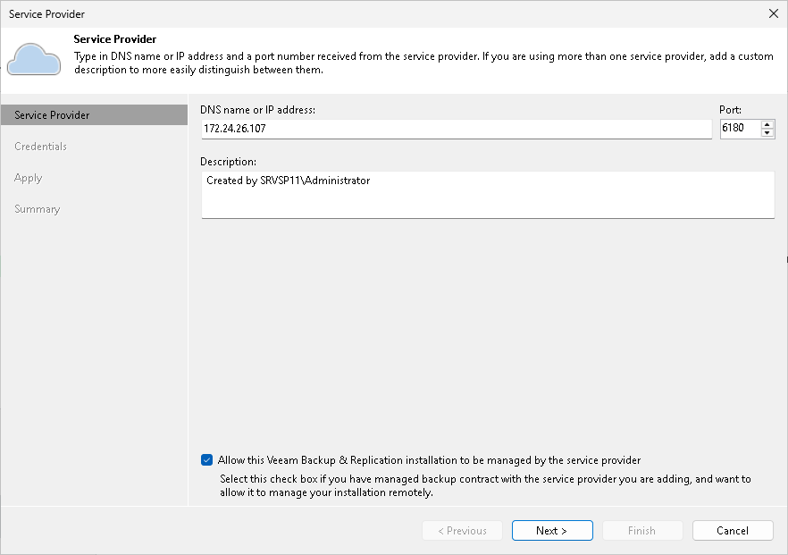

In this article

At the Service Provider step of the wizard, specify settings for the cloud gateway that the SP has provided to you.

1. In the DNS name or IP address field, enter a full DNS name or IP address of the cloud gateway.
2. In the Port field, specify the port over which the tenant Veeam backup server will communicate with the cloud gateway. By default, port 6180 is used.
3. In the Description field, provide a description for the SP you are adding.
4. Select the Allow this Veeam Backup & Replication installation to be managed by the service provider check box if the SP should manage the tenant Veeam backup server under the Backup as a Service agreement.

If you select this option, Veeam Backup & Replication will install the remote management agent on the tenant Veeam backup server. The SP will be able to manage this backup server with Veeam Service Provider Console.

If you select this option, Veeam Backup & Replication on the SP side will also display names of objects included in tenant backup jobs instead of replacing object names with identifiers. To learn more, see [Viewing Real-Time Statistics](realtime_statistics.md#counters).

|  |
| --- |
| Important |
| If the SP has several cloud gateways, you must specify settings of only one gateway to connect to the SP. Veeam Backup & Replication will automatically retrieve information about all other cloud gateways and will use them for transferring data to/from the cloud repository and cloud host. |

Page updated 1/30/2024

Page content applies to build 13.0.1.1071
