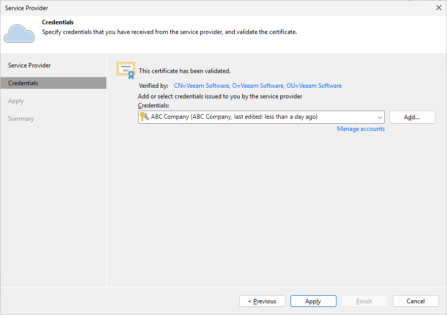

In this article

At the Credentials step of the wizard, verify TLS certificate settings and specify settings for the tenant account that you want to use to connect to the cloud repository.

1. At the top of the wizard window, Veeam Backup & Replication displays information about the TLS certificate obtained from the SP side. You can view the certificate settings and verify the TLS certificate.

TLS certificate verification is optional. You can use this option to verify self-signed TLS certificates. TLS certificates signed by the CA do not require additional verification.

+ To view the TLS certificate, click the certificate link.
+ To verify if the TLS certificate with a thumbprint, copy the thumbprint you obtained from the SP to the Clipboard and enter it to the Thumbprint field. Click Verify. Veeam Backup & Replication will check if the thumbprint you enter matches the thumbprint of the obtained TLS certificate.

1. From the Credentials list, select credentials for the tenant account that the SP has provided to you. If you have not set up credentials beforehand, click the Manage accounts link or click Add on the right to add necessary credentials.

|  |
| --- |
| Note |
| If the SP allocated to you replication resources in VMware Cloud Director, you must provide credentials for the VMware Cloud Director tenant account in one of the following formats: Organization\Username or Username@Organization. For example: TechCompanyOrg\Administrator or Administrator@TechCompanyOrg. |

Page updated 10/26/2025

Page content applies to build 13.0.1.1071
