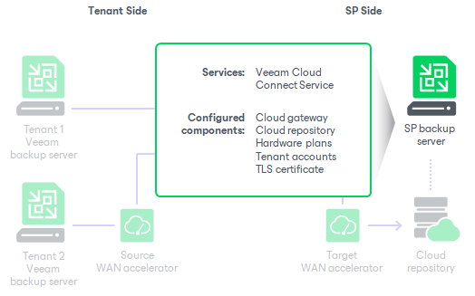

# SP Veeam Backup Server

The Veeam Cloud Connect infrastructure is organized around the Veeam backup server running on the SP side. The SP Veeam backup server is a configuration and control center of the Veeam Cloud Connect infrastructure. The SP uses the Veeam backup server to set up the Veeam Cloud Connect infrastructure and deliver Backup as a Service and Disaster Recovery as a Service to tenants.

The SP Veeam backup server runs the Veeam Cloud Connect Service — a Microsoft Windows service that is responsible for the following operations:

* Providing tenants with access to cloud repositories and cloud hosts
* Controlling transport services that work with tenant cloud repositories and cloud hosts
* Communicating with the Veeam Backup & Replication database

The Veeam Cloud Connect Service is deployed on every Veeam backup server. However, Veeam Backup & Replication uses this service only for work with Veeam Cloud Connect infrastructure components.

|  |
| --- |
| Important |
| The SP must not stop or disable other Veeam Backup & Replication services running on the SP backup server. For example, in case the SP does not use the Continuous Data Protection (CDP) functionality, the Veeam CDP Coordinator Service must still run on the backup server. |

|  |
| --- |
| Note |
| If the SP uses Veeam Service Provider Console and wants to use multi-factor authentication (MFA) on the SP backup server, they must set up a service account in Veeam Backup & Replication. For details, see [this Veeam KB article](https://www.veeam.com/kb4431).  To learn more about MFA support in Veeam Backup & Replication, see the [Multi-Factor Authentication](https://helpcenter.veeam.com/docs/vbr/userguide/mfa.html?ver=13) section in the Veeam Backup & Replication User Guide. |

Limitations for SP Veeam Backup Server

The SP Veeam backup server is intended to be used exclusively for configuring Veeam Cloud Connect infrastructure and providing cloud resources to tenants. The SP cannot perform the following operations on the SP Veeam backup server:

* Perform restore tasks with tenant backups other than Instant Recovery, restore to Microsoft Azure and Amazon EC2. For example, the SP cannot import tenant backups in the SP Veeam backup console to restore data from these backups.

To perform such data restore tasks, the SP must deploy a separate backup server in their backup infrastructure and do either of the following:

* Rescan the repository with tenant backups. To learn how to rescan a repository, see the [Rescanning Backup Repositories](https://helpcenter.veeam.com/docs/vbr/userguide/rescanning_backup_repositories.html?ver=13) section in the Veeam Backup & Replication User Guide. In this scenario, the SP can use its existing Veeam Cloud Connect license on the backup server.
* Import tenant backups. In this scenario, the SP must install a separate license key on this backup server. The trial license key works for this scenario.

* Add itself as an SP in the Veeam Backup & Replication console, for example, to address specific scenarios that were supported in previous versions of Veeam Backup & Replication. For such scenarios, the SP must deploy a separate backup server in its backup infrastructure. The SP can use their existing Veeam Cloud Connect license on this backup server.
* Run backup, backup copy or replication jobs, for example, to back up VMs in the SP virtual environment, or to copy tenant VM backups to a secondary location. To create and run jobs, the SP must deploy a separate backup server (and other Veeam Backup & Replication components) and also obtain a separate license key and install it on this backup server.

Note that the SP can configure backup copy jobs for backups created by public cloud appliances. To learn more, see [Support for Veeam Backup for Public Clouds](cc_public_cloud_backups.md).

|  |
| --- |
| Note |
| The use of the same Veeam backup server to provide Veeam Cloud Connect services and to run backup, backup copy and replication jobs is supported only for Veeam Cloud Connect for the Enterprise. For more information, see [this Veeam webpage](https://www.veeam.com/cloud-connect-enterprise-backup.html).  Note that in this scenario, a configuration where two SPs are added on each other's backup servers is not supported. For example, you have two Veeam Cloud Connect for the Enterprise servers: Server 1 and Server 2. If you add Server 2 as an SP on Server 1, you must not add Server 1 as an SP on Server 2. |

Related Tasks

[Deploying SP Veeam Backup Server](cloud_connect_sp_vbr_deploy.md)

