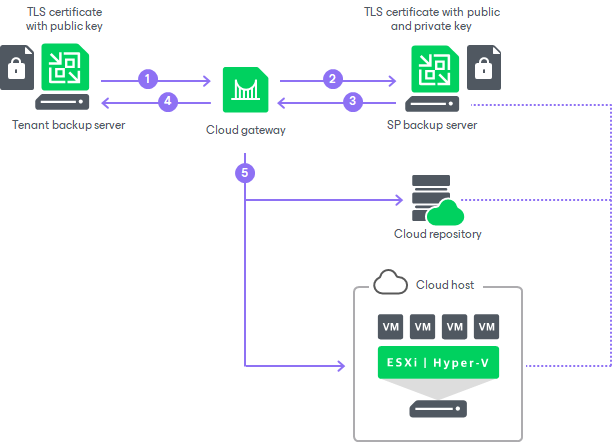

In this article

TLS certificates are installed on the following components in the Veeam Cloud Connect infrastructure:

* The TLS certificate with a public key and private key is installed on the SP Veeam backup server. The tenant account under which the Veeam Cloud Connect Service runs must have permissions to access this TLS certificate.
* The TLS certificate with a public key is installed on all tenants’ Veeam backup servers (in case of self-signed certificates).

When the tenant starts a job or task targeted at the cloud repository or the cloud host, the parties perform a TLS handshake to authenticate themselves:

1. To connect to Veeam Cloud Connect resources (cloud repository and cloud host), the Veeam backup server on the tenant side sends a request to the cloud gateway.
2. The cloud gateway passes this request to the SP Veeam backup server.
3. The SP Veeam backup server exposes a TLS certificate installed on it to tenant Veeam backup server through the cloud gateway.
4. Tenant Veeam backup server checks if the exposed TLS certificate is trusted or matches the TLS certificate saved in the Veeam Backup & Replication database.
5. The SP Veeam backup server establishes a secure communication channel in the Veeam Cloud Connect infrastructure, and VM data from the tenant side is transported to the cloud repository or cloud host.

Veeam Backup & Replication supports both wildcard certificates and certificates that have multiple FQDNs listed in the Subject or Subject Alternative Name field.

If you use a wildcard certificate (like \*.domain.com), cloud gateways having DNS names that do not include .domain.com will not be trusted, and Veeam Backup & Replication will not use these cloud gateways for communication with the cloud repository.

Page updated 7/25/2023

Page content applies to build 13.0.1.1071
