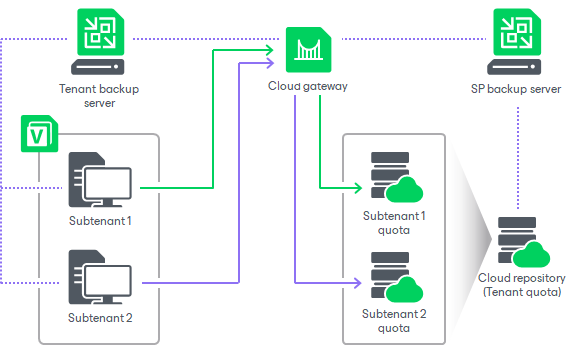

In this article

When the tenant or SP creates a subtenant account, they provide to the created account a subtenant quota. A subtenant quota is an amount of storage space within the tenant quota on the cloud repository. The subtenant can consume storage resources provided through the subtenant quota for storing Veeam Agent backups on the cloud repository.

The tenant or SP can allocate only one quota on one cloud repository for each subtenant account. If the tenant or SP wants to provide to a user multiple quotas on the same or different cloud repositories, they must create different subtenant accounts for this user.

The tenant or SP can specify the size of the subtenant quota or create unlimited subtenant quota. With unlimited subtenant quota, subtenant can use all storage space within the tenant quota on the cloud repository. In this case, the tenant should monitor tenant quota consumption to make sure that the amount of free space on the cloud repository is sufficient for storing backups created by this tenant and its subtenants.

|  |
| --- |
| Note |
| For managed subtenant accounts, consider the following:   * By default, Veeam Backup & Replication creates managed subtenant accounts with unlimited subtenant quota. The tenant or SP can edit the necessary subtenant account and specify the desired subtenant quota limit for the account. * Managed subtenant accounts support multiple subtenant quotas. This allows Veeam Backup & Replication to use the same subtenant account to back up the same machine with multiple Veeam Agent backup jobs targeted at different cloud repositories. |

Page updated 1/26/2024

Page content applies to build 13.0.1.1071
