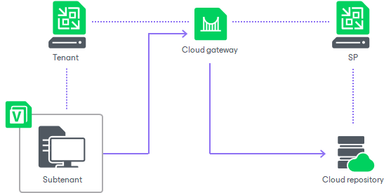

In this article

Veeam Backup & Replication supports creating Veeam Agent backups on the cloud repository. Tenants can back up to the cloud not only their VM data but also data stored on physical devices — servers, desktops, laptops, and so on. To let the tenant provide different Veeam Agent users with access to the cloud repository, Veeam Backup & Replication offers the concept of subtenants.

In terms of Veeam Backup & Replication, a subtenant is a user on the tenant side who connects to the SP on their own account and uses their own individual quota on the cloud repository. To learn more, see [Subtenant Account](cloud_connect_subtenant_account.md) and [Subtenant Quota](cloud_connect_subtenant_quota.md).

|  |
| --- |
| Note |
| Consider the following:   * End users on the tenant side can use subtenant accounts only to connect to the SP in Veeam Agent for Microsoft Windows and Veeam Agent for Linux. The tenant cannot use credentials of a subtenant account to add a SP in the Veeam backup console. * Veeam Agent users on the tenant side can connect to the SP and create backups on the cloud repository under the tenant account. However, it is recommended to provide every user with a separate subtenant account. In this case, the tenant or SP can allocate storage resources on the cloud repository individually for every subtenant so that subtenants’ data is stored in the cloud in an isolated and segregated way. |

Communication between the subtenant and the SP is carried out in the similar way as between the tenant and the SP. The subtenant connects to the SP, configures a backup job targeted at the cloud repository and transmits backed-up data to the SP side. The difference is that the data is transmitted to the cloud repository from the Veeam Agent computer, and not from a VM on a tenant virtualization host.

The tenant can view properties of Veeam Agent backups created by subtenants on the cloud repository and delete such backups from the cloud repository. To recover data from Veeam Agent backups, the tenant can perform the following operations:

* Export computer disks as virtual disks
* Restore guest OS files

Related Topics

* [Subtenant Account](cloud_connect_subtenant_account.md)
* [Subtenant Quota](cloud_connect_subtenant_quota.md)

Related Tasks

* [Managing Subtenant Accounts on SP Side](cloud_connect_subtenants_manage.md)
* [Managing Subtenant Accounts on Tenant Side](cloud_connect_subtenants_use.md)

Page updated 9/17/2025

Page content applies to build 13.0.1.1071
